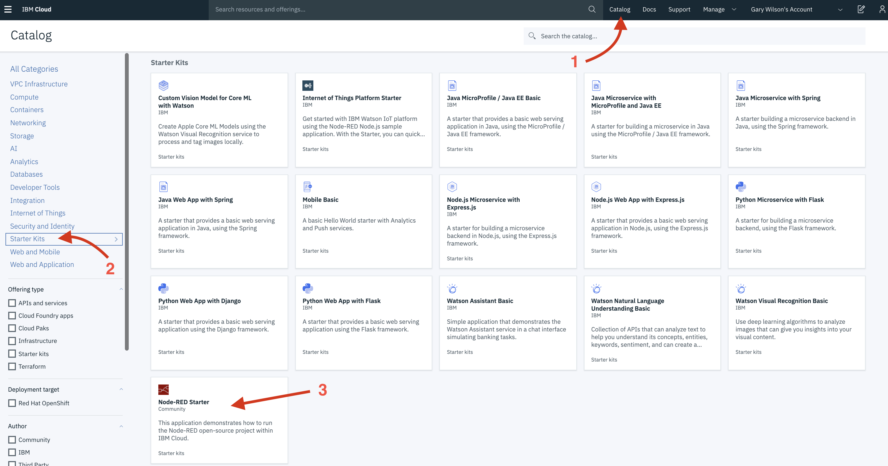
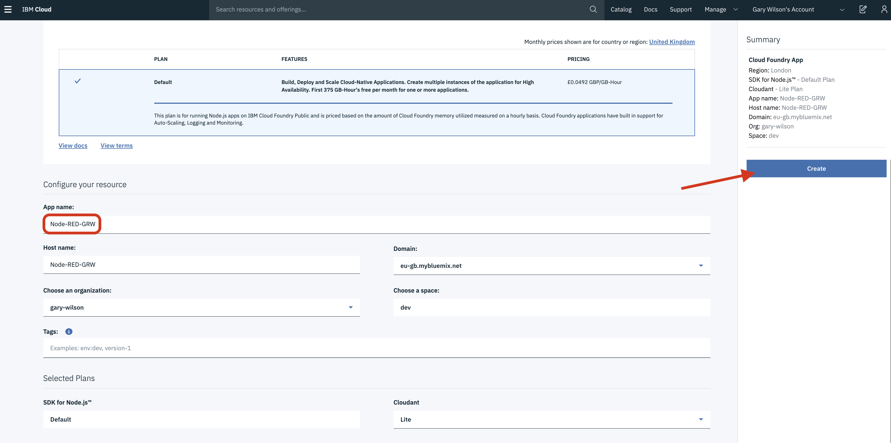
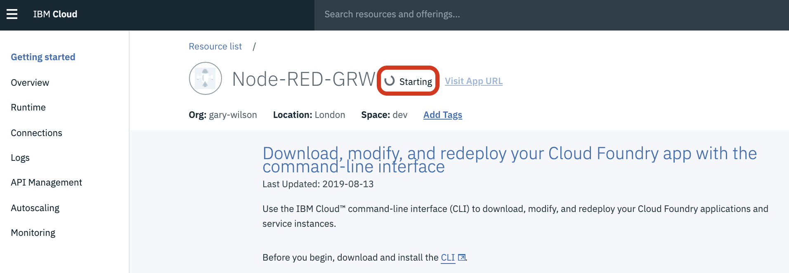
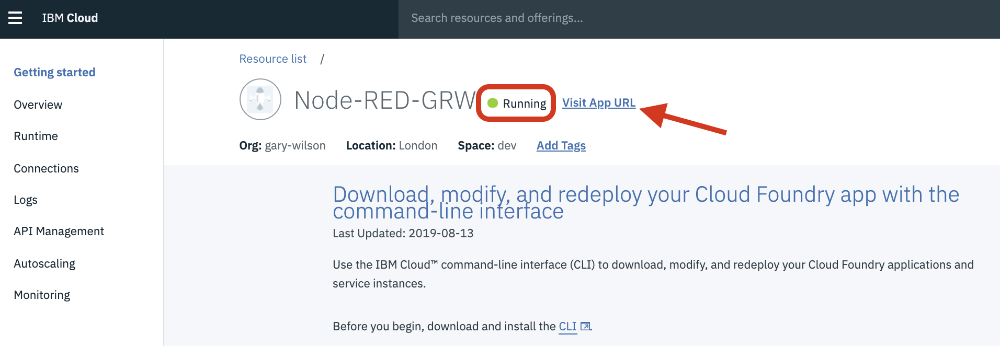
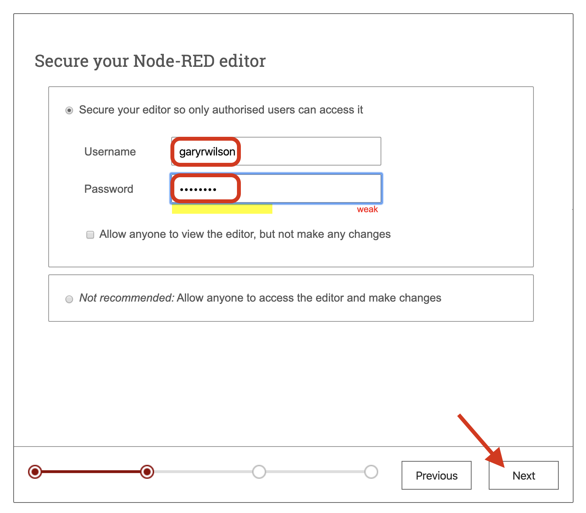
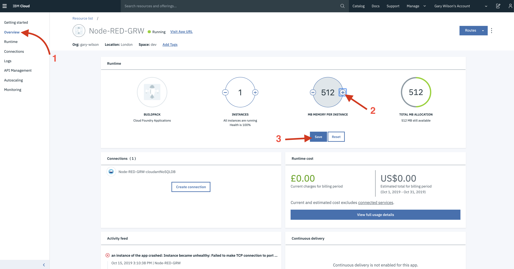
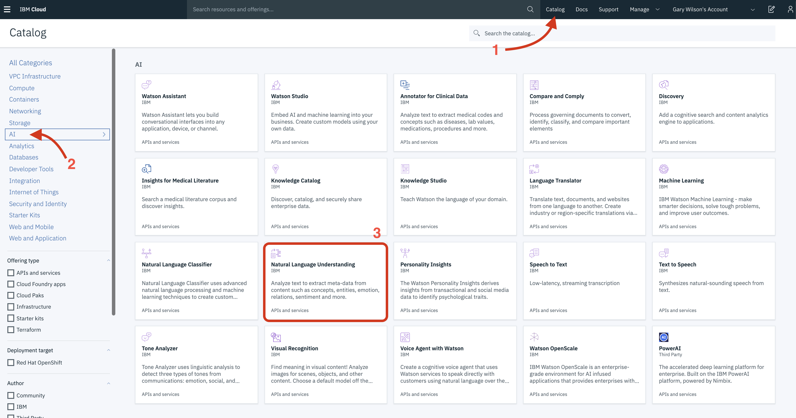
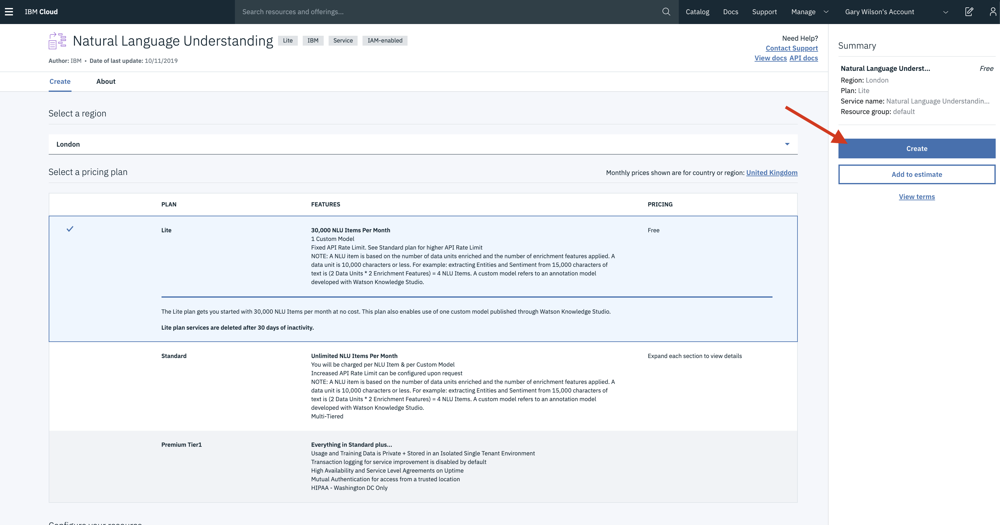
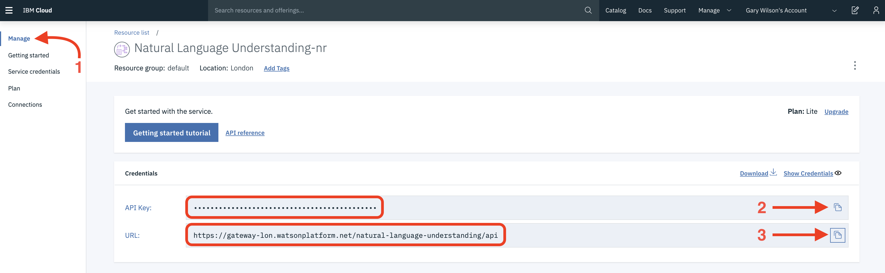

# **Lab 1:** _Setting up **Node-RED** and **IBM Watson** on IBM Cloud_
You can install Node-RED locally on your own computer, on devices such as Raspberry Pis and Arduinos, and in the cloud using services from IBM, Microsoft and Amazon. In this tutorial we will run Node-RED on the **IBM Cloud**. If you want to know more about setting up Node-RED in other environments, go [here](https://nodered.org/docs/getting-started/).

After we've installed Node-RED, we'll also setup the IBM Watson AI services that we're going to use in this tutorial.

# Create Node-RED application
**(1)** Login to [IBM Cloud](https://cloud.ibm.com).

**(2)** Click on `Catalog`, `Starter Kits`, and `Node-RED Starter`.

**(3)** Scroll down to `App name`. Here you need to enter a unique name for your Node-RED instance, for example **Node-RED-_yourinitials_**. Then hit `Create`.

**(4)** In a few moments time you'll be transported to the `Getting Started` screen for your Node-RED application, where you'll see the status of `Starting`.

What is happening here is that IBM Cloud is creating all of the resources you need to run your own instance of Node-RED - it's allocating physical infrastructure, creating a database to store your Node-RED programs, deploying the Node-RED application code, and publishing it to a publicly available website so that you can access it in a web browser.

**(5)** A few minutes later, you should see the status change to `Running`. This means your Node-RED environment is available. Access it now by selecting `Visit App URL`.

**(6)** The first time you log on to your new Node-RED application, you'll have to do small amount of configuration.

On the first Welcome screen, hit `Next`.

On the next `Secure your Node-RED editor` screen, enter a `Username` and `Password` that you will use to login to your Node-RED application. You can use any name and password here, but please ensure you are careful typing in your password and that you remember it!

**(7)** On the `Browse available IBM Cloud nodes screen`, you can click `Next`. This is an informational screen which highlights the fact that Node-RED is an open source application that is supported by a user community. Node-RED comes pre-installed with a number of "building blocks" (nodes) that allow you to build applications, but the community also contributes additional capability by providing more nodes that you can import and use. You'll see how this works during this tutorial, but for more information, you can go [here](https://flows.nodered.org/).

Now click `Finish` on the `Finish the install` screen.

**(8)** After a few moments, you'll see the Node-RED welcome screen. Click `Go to your Node-RED flow editor`, login with the username and password you've just specified, and you'll be taken to your new Node-RED environment.

**(9)** Congratulations! You can now start to build applications using Node-RED's visual editor. However ... we do need to do a few more things before we can really get started.

Start by increasing the amount of memory that your Node-RED application has allocated: go back to **IBM Cloud**, select `Overview` from the sidebar, and then increase `MB MEMORY PER INSTANCE` to **512**, before hitting `Save`.

Your Node-RED instance will then automatically restart with more memory allocated.

# Create IBM Watson services
For the applications we are going to build in this tutorial, we need to access and use some of IBM Watson's AI services. Watson has a number of these services, but we are going to use just three of them here:

- Watson Natural Language Understanding
- Watson Visual Recognition
- Watson Language Translator

**(1)** We therefore need to provision an instance of each of these services. Within **IBM Cloud**, go back to the `Catalog`, select `AI` from the sidebar, and then `Natural Language Understanding`.

**(2)** On the next screen you can leave everything to the defaults, and hit `Create` to spin up your **Natural Language Understanding** (NLU) service.

_If you want to you can scroll down and change the `Service name` before you hit `Create`, but this isn't really necessary._

**(3)** You'll now be taken to a `Getting Started` page for your NLU service. From here, click `Manage` on the sidebar and you'll see the services **security credentials**.

Each of the IBM Watson services you create has associated  **credentials** - this is a security measure to ensure that only you (or anybody you supply the credentials to) can use the service.

Click the `Copy to clipboard` icon to the right of the `API Key` field to copy the key, and then paste this in a document or note somewhere, then do the same with the `URL`. We'll need these later on when we're building our Node-RED apps.

**(4)** Now repeat this process to create both **Visual Recognition** and **Language Translator** services: select `Catalog`, then `AI` from the sidebar, click the respective service, then `Create` on the next screen.

Don't forget to save the security credentials for these two additional services too!

**OK that's setup done! Let's move onto creating our first Node-RED application. Click [here](../2-Hello-World) to go to Lab 2.**
