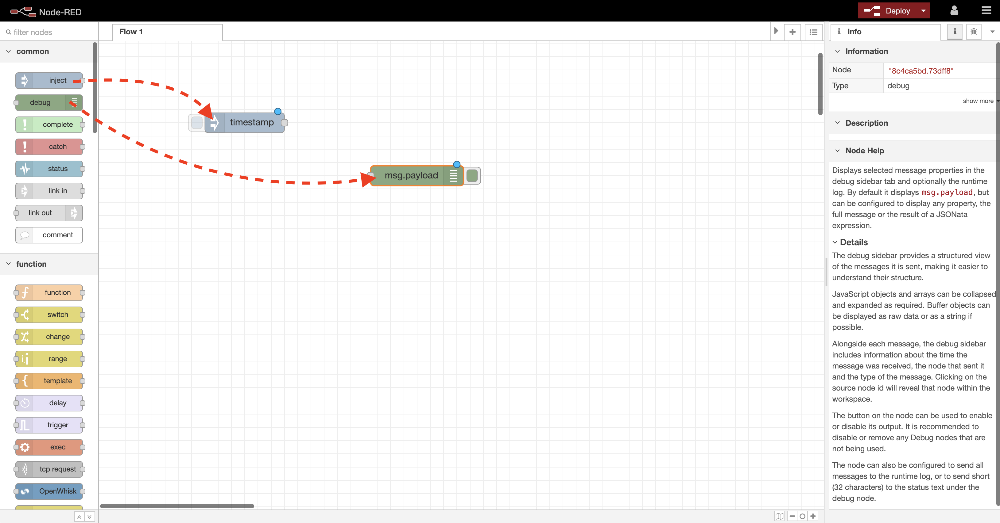
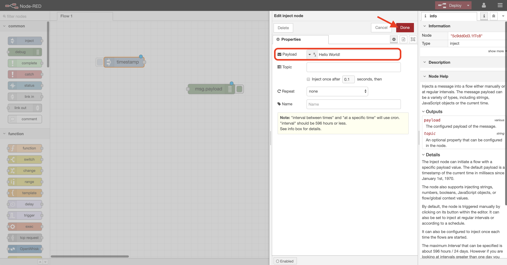
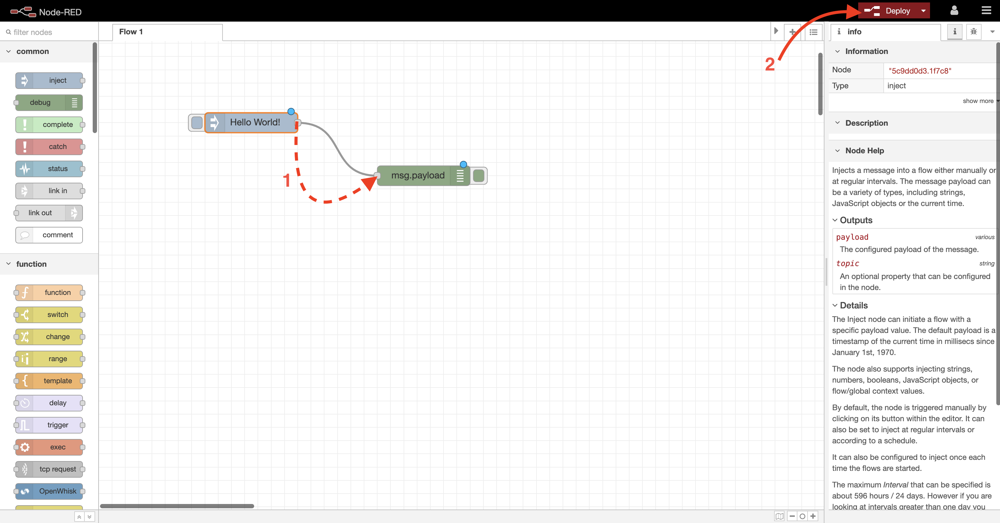
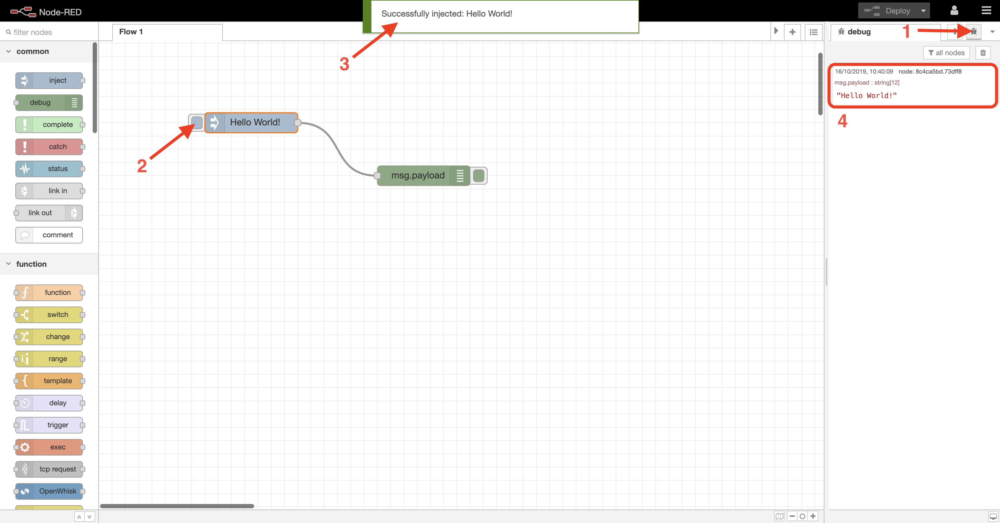
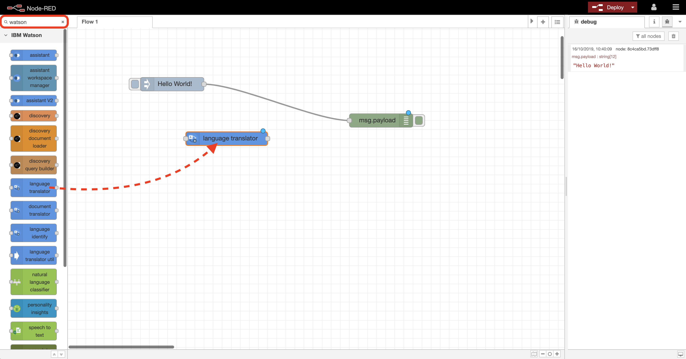
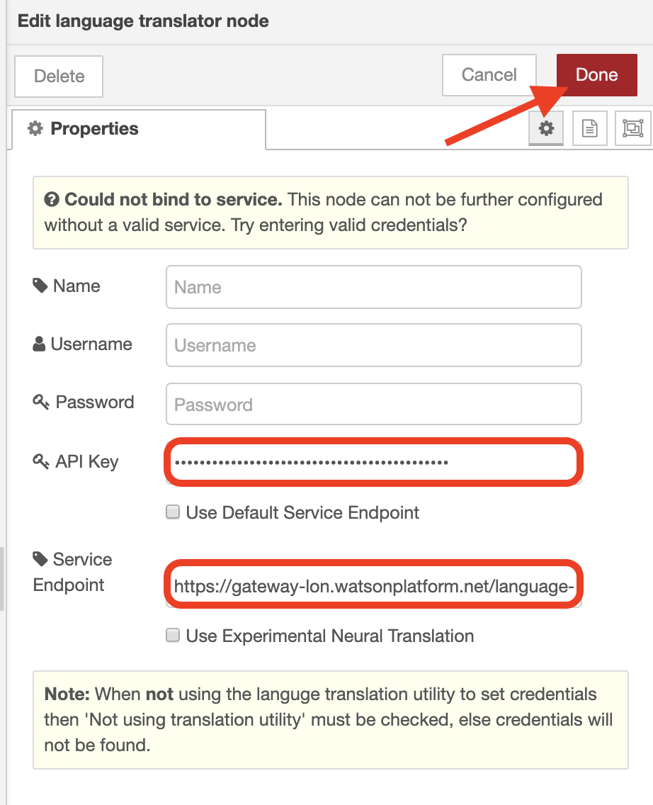
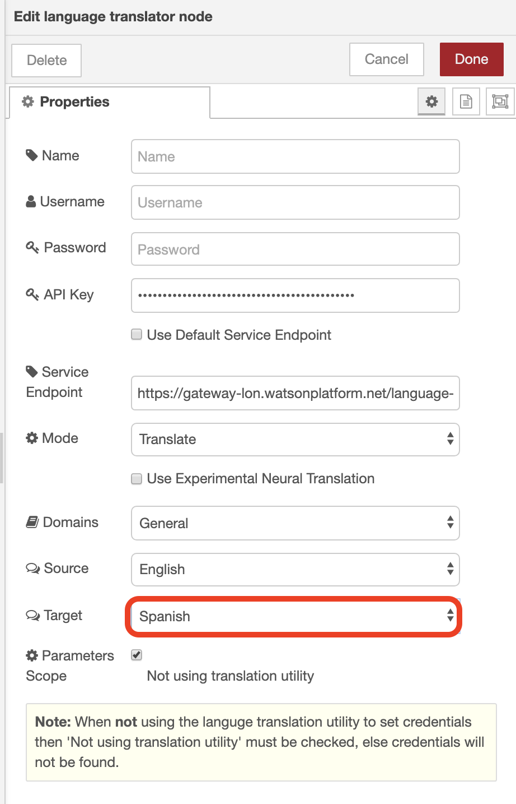
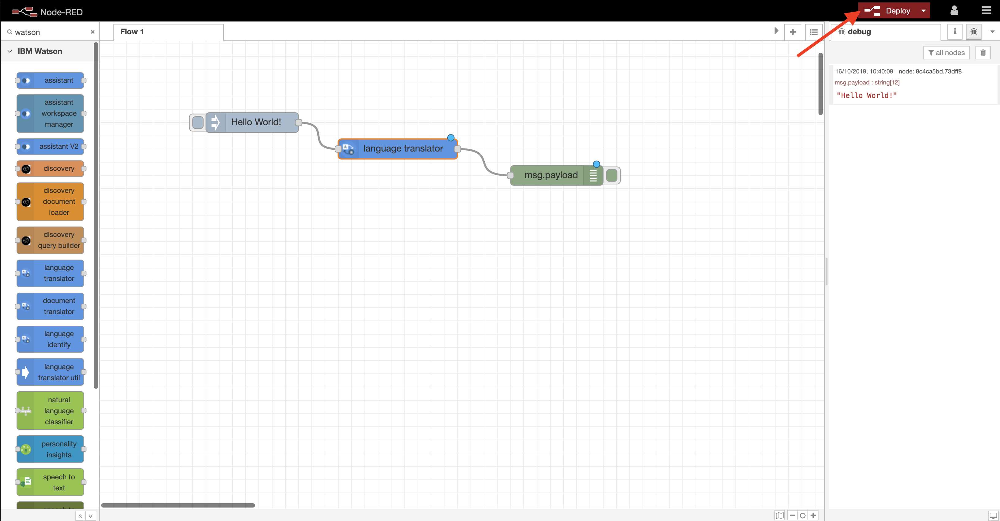
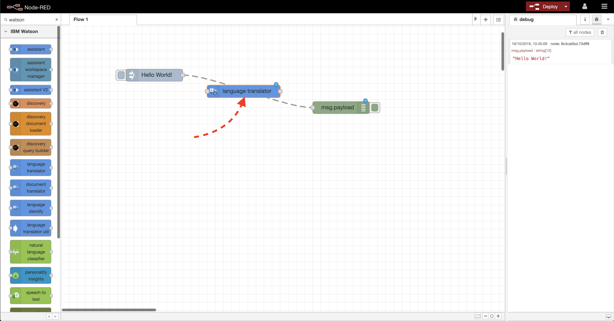
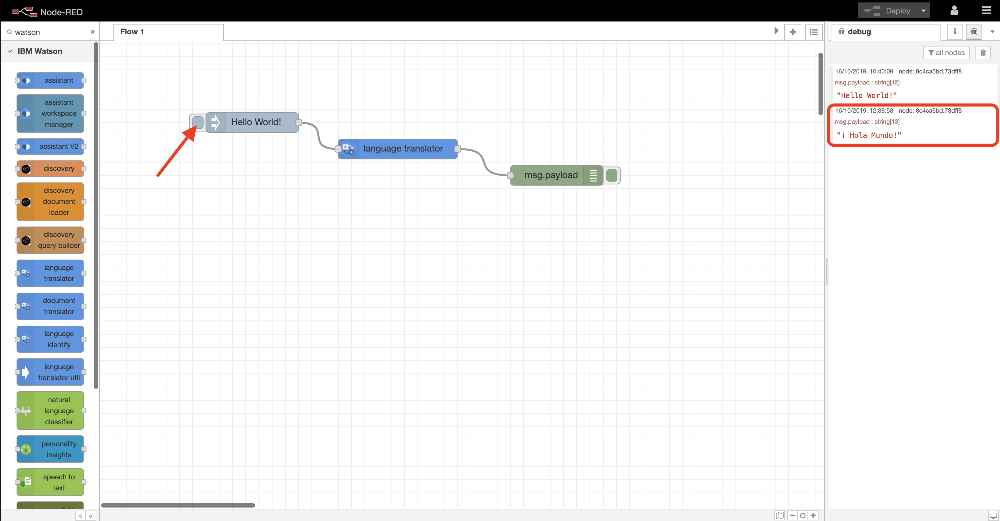

# **Lab 2:** _Hello World!_
As all good coders know, writing a **"Hello World!"** program is a rite of passage when learning a new programming language, so here is where we start, in order to demonstrate the basics of how Node-RED applications are built.

**(1)** Go back to your Node-RED application. You will probably have to login again, as the app restarted when you previously increased its available memory.

Node-RED apps are built by creating **flows** - connected "building blocks" (**nodes**) that receive data, perform some sort of transformation on the data received, and then pass it to the next node, until the end result is achieved.

Our "**Hello World!**" app is a simple one. It just needs a node that sends (injects) the "Hello World!" text to a node that can output (debug) it.

**(2)** In your Node-RED application, drag an `Inject` node and then a `Debug` node from the palette at the side of the editor onto the main part of the workspace.

**(3)** Now double-click the `Inject` node. It currently displays as `timestamp` in the editor, as the current time is the default data that will be sent to the next node.

Double-clicking on a node allows you to edit its `Properties`.

Change the `Payload` field dropdown from `timestamp` to `string`, type `Hello World!` into the `Payload` field, and click `Done`.

This means that we will now send the text string "**Hello World!**" to any node connected to this one.

**(4)** The `Debug` node does not need to be modified for this simple Node-RED flow. By default, a `Debug` node will output whatever data it has in the **payload** section of the **message** it receives (you'll see it referred to as **msg.payload**), and our `Inject` node has been configured to send the "Hello World!" text string in this way.

Simply connect up the nodes now to complete your first Node-RED flow. _Click and hold_ the small grey box on the right-hand side of the `Inject` node, and _drag_ to the small grey box on the left-hand side of `Debug` node.

Once your nodes are connected, hit `Deploy` to send your code up to the IBM Cloud so it can be executed.

You'll see a `Successfully deployed` message, and now you can run your program!

**(5)** First click the small `Debug messages` icon at the top left. This is where we see the output from Node-RED Debug nodes.

Next, click the button to the left of the `Inject` node to instigate the sending of the "Hello World!" message.

You'll then see a `Successfully injected` information message, and then our "Hello World!" text will appear in the `Debug` window.

**Success!** You've built your first Node-RED flow. All Node-RED applications are created in this way. Messages are created, then subsequently transformed by consecutive, connected nodes, before being output in some way.

**(6)** Now let's introduce our first IBM Watson service. To keep it simple, we'll extend our **Hello World!** flow so that it translates the original text into another language before outputting the result.

Drag a `language translator` node onto the workspace. You can find this node either by scrolling down the sidebar, or you can filter the node list by `watson` or `language` (top left) to find it more easily.

**(7)** Double-click the `language translator` node to edit its properties.

First, go to wherever you previously stored your **IBM Watson** service _security credentials_, and copy the API key for the **Language Translator** services into the `API Key` field of the `language translator` node properties.

Next, untick `Use Default Service Endpoint`, and copy the URL you previously saved from the **Language Translator** service into the `Service Endpoint` field. Now hit `Done`.

Doing this provides Node-RED with the security credentials it needs to be able to access the relevant service. In this case, we will be sending some text to the Watson Language Translator service, and it will return some translated text.

**(8)** After you have clicked `Done`, go back into the `language translator` node properties again, where you will see that more options are now available.

Change the `Target` field to `Spanish` and hit `Done`.

**(9)** Now we need to insert our `language translator` node into our flow at the appropriate point - in this case between the `Inject` and `Debug` nodes.

You can do this in two ways:

- Delete the existing connection between the `Inject` and `Debug` nodes, then connect the nodes up like so:

- Drag the `language translator` node directly over the link connecting the `Inject` and `Debug` nodes. Drop the node when you see a dotted line, and it will automatically create the appropriate connections.

Either way should give the same result.

Once the nodes are connected in this way, hit `Deploy`.

**(10)** Now click the button to the left of the `Inject` node again to run the flow. This time the "Hello World!" string is injected into the **IBM Watson** `language translator` node, and translated into Spanish before being sent to the `Debug` node for output.

**Well done! You've created your first Node-RED flow, and integrated it with an IBM Watson service. Time to move on to building more complex flows in [Lab 3](../3-NLU).**
