# **Lab 3:** _Analysing a Webpage Using Node-RED and IBM Watson_
Our next lab will step you through creating a more complex Node-RED flow. When built, the flow will take the content of a webpage that you specify, runs the text content of the page through **Watson Natural Language Understanding**, and send the output of that to the Node-RED debug console.

**Watson Natural Language Understanding (NLU)** allows us analyse the semantic features of text by extracting metadata such as concepts, entities, keywords, categories, relations and roles from provided content.

It can also understand sentiment and emotion, and returns both overall sentiment and emotion for a page or document, as well as targeted sentiment and emotion against keywords in the text for deeper analysis. It can do all this in thirteen languages.

NLU can be useful in many scenarios that demand rapid analysis of text without requiring in-depth natural language processing expertise. For example, you could monitor sentiment and emotion in customer support chat transcripts, or you can quickly categorise blog posts and sort them based on general concepts, keywords, and entities.

**(1)** Go to your Node-RED application, and we'll start to build up a Node-RED flow that will use **Watson NLU** to analyse text from a web page.

Create a new tab in Node-RED by clicking the `Add tab` icon. This will give us an empty workspace that we can use to create our new flow.

Note also if you double-click a Node-RED tab heading, you can rename it to something more meaningful.

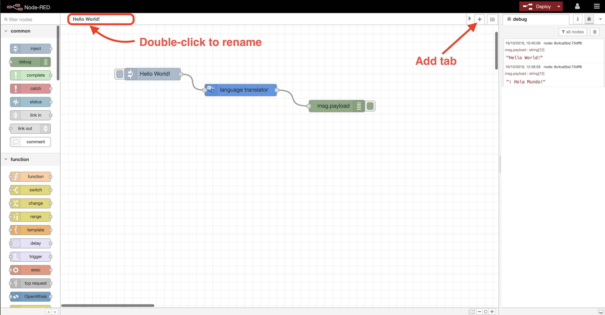

**(2)** Drop in the following nodes, remembering that you can search for a node in the sidebar palette by using the filter at the top left:
- `Inject`
- `HTTP Request`
- `Debug`

Double-click the `Inject` node and just change the contents of the `Name` field from the default of **blank** to **Start**.

Edit the `HTTP Request` node by double-clicking it, and ensure the `Method` selected is `GET` and that we `Return` `a UTF-8 string`. Now enter a web page address that you want to analyse into the `URL` field. We're looking for something with a reasonable amount of text here, so good examples would be a _Wikipedia page_ or a _BBC News article_.

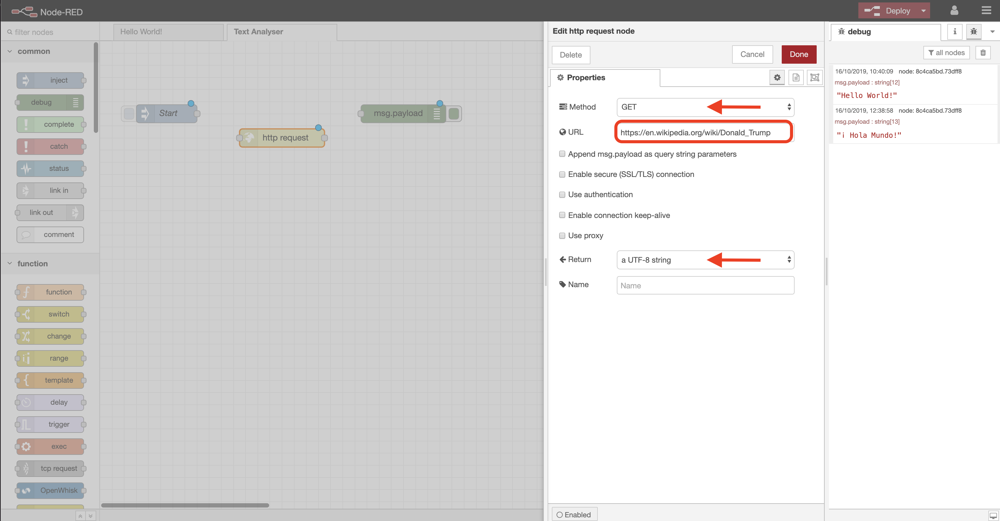

Modify the `Debug` node so it outputs the `complete message object` rather than just `msg.payload`. This is because we'll need to see the full content of the message returned from Watson NLU a little later, as the NLU service doesn't return its data in the default **msg.payload** variable.

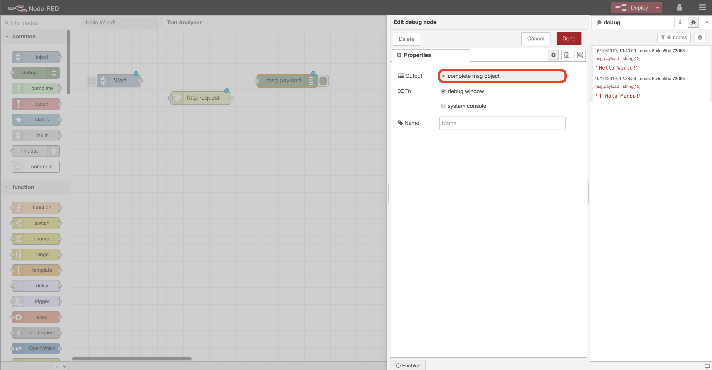

**(3)** Connect the nodes up and `Deploy`. When you hit the button on the `Inject` node, the flow retrieves the entire content of the webpage you specified in the `HTTP Request` node, and outputs it to the debug window as a message.

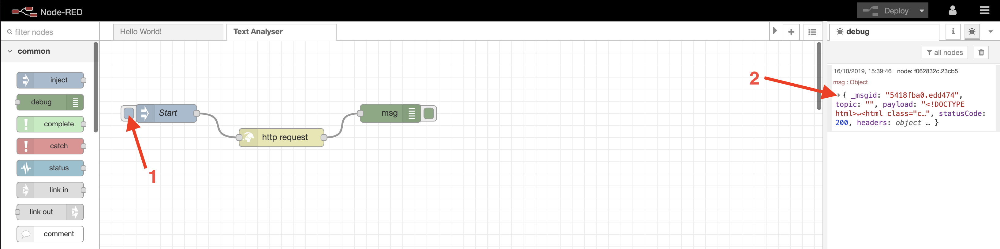

Messages are compacted in the debug window, as they can be quite long. Select the `twistie` at the top of the message to see more of the content.

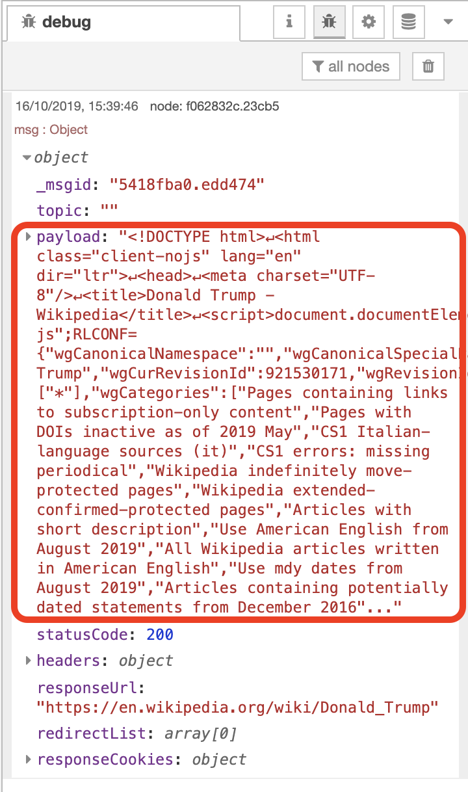

As you can see, **msg.payload** includes all of the text _plus_ the HTML formatting from the URL we provided.

**(4)** Clearly we want to just analyse the **text** from the web page and ignore the formatting content, and we can extract the text by pulling only the content held within each of the `paragraph` or `
` tags within the HTML.

If you use **Chrome Developer Tools** whilst on a webpage you can get an idea of how this works:

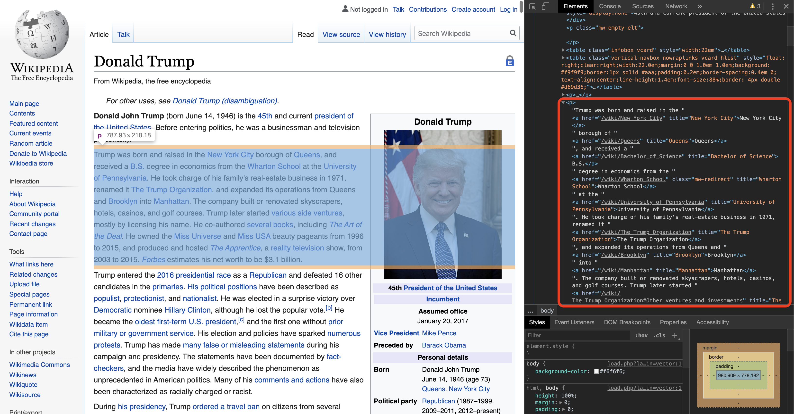

Drop in an `html` node, and modify it's properties to look like this:

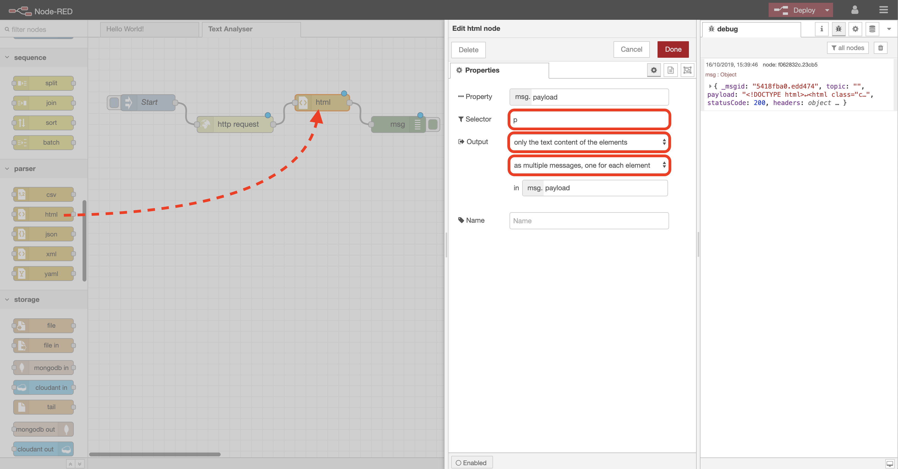

**(5)** Connect the node up as shown, `Deploy` the flow and hit the `Inject` button. The debug output should this time show a series of separate messages, but where each `msg.payload` contains just a paragraph of text and none of the HTML data.

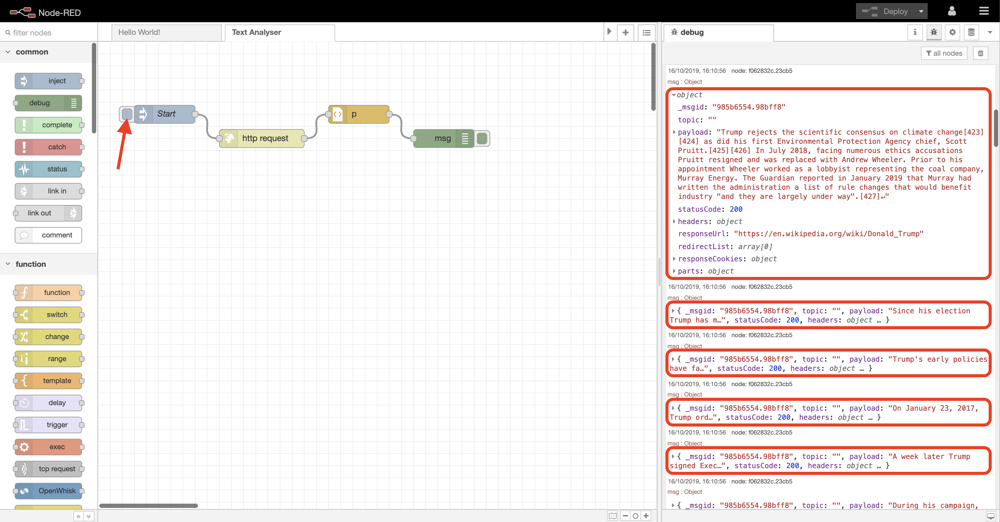

**(6)** This is the data we need to feed through the **Watson NLU** service, but we want to do this as a single article/message, rather than a set of disparate paragraphs. Fortunately Node-RED has a `join` node which can merge all of our messages into one.

Drop one of these in now. Edit its properties to change `Mode` to **manual**, and then enter **3** in the `After a timeout following the first message` field. The individual paragraph messages will arrive at this node in quick succession, so setting the timeout field ensures we keep collecting and joining these together until a 3 second delay suggests they have stopped arriving.

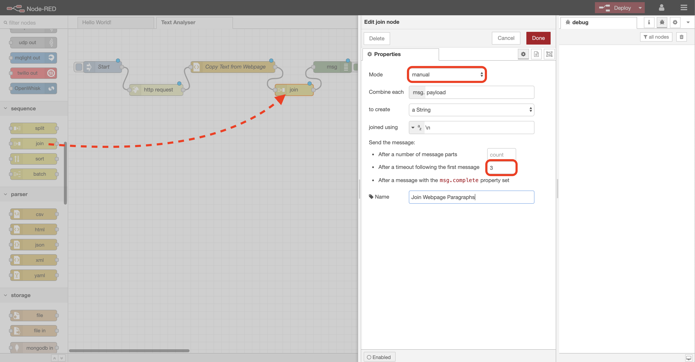

**(7)** Connect the `join` node in as you can see below. `Deploy` and hit `Inject` again, and you should see just one message, where `msg.payload` consists of _all_ of the extracted text.

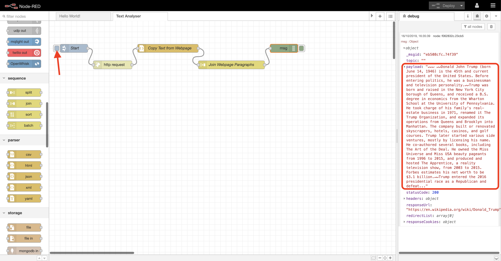

_The content of the single message is purposely truncated in the debug window._

**(8)** Drop in a `Natural Language Understanding` node, and edit its properties.

First provide the **security credentials** for the NLU service that you saved earlier - via the `API Key` and `Service Endpoint` fields, then tick the following options:

- `Document Emotion`
- `Document Sentiment`
- `Entities`
- `Entity Emotion`
- `Entity Sentiment`

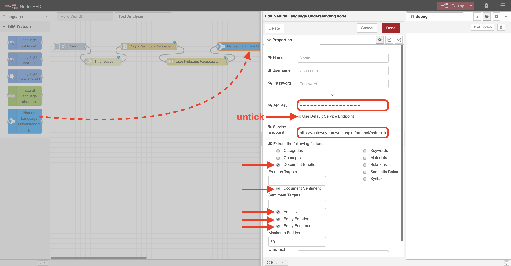

**(9)** Connect the `NLU` node as shown, `Deploy` and `Inject` once more. When the output message arrives in the debug window, expand the `msg.features` section of the message produced - this is where the `NLU` node places its results.

Here you can see the overall document sentiment and emotion analysis.

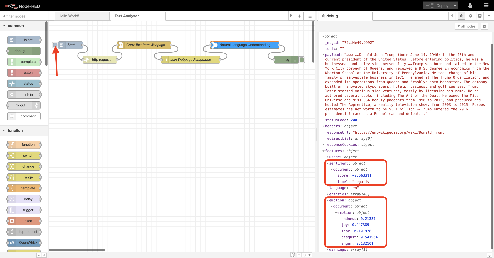

If you open up the `entities` section of `msg.features`, you'll see all of the entities that **Watson NLU** has recognised in the text and extracted (there are 46 in this case). As well as being able to identify people, organisations, companies, facilities, etc., **Watson NLU** can provide a sentiment and emotion score for _each entity identified_ within a document. This can highlight not only the overall tone of a document, but the tone attached to individual entities within a document.

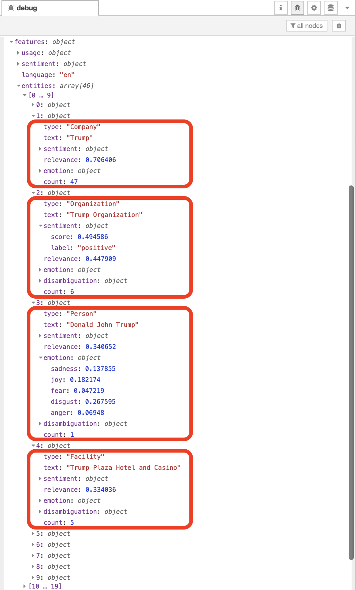

Here's a full list of what **Watson NLU** can derive from a document. Go [here](https://cloud.ibm.com/docs/services/natural-language-understanding?topic=natural-language-understanding-about) if you want to learn more.

Analysis       | Description
---------------|-------------------------------------------------------------------------------------------------------------------------------------------------------------------------------------
Sentiment      | The general sentiment of your content
Emotion        | Detects anger, disgust, fear, joy, or sadness that is conveyed in the content
Keywords       | Returns important keywords in the content
Entities       | Extracts people, companies, organisations, cities, geographic features, and other information from the content
Categories     | Classifies content into a hierarchy that's five levels deep
Concepts       | Returns high-level concepts in the content. For example, a research paper about deep learning might return the concept, "Artificial Intelligence" although the term is not mentioned
Semantic Roles | Parses sentences into subject, action, and object form

You can apply _**Watson NLU**_ to various use cases, including content recommendation, advertising optimisation, audience segmentation, data mining and voice-of-customer analysis.

**Congratulations! You've created your first more complex Node-RED flow, which included extracting information from an external source, manipulating multiple messages, and using another IBM Watson AI service. Now let's take build on this and create a live dashboard that will display these results in a more readable fashion in [Lab 4](../4-Dashboard).**
