# **Lab 4:** _Building an IBM Watson Text Analytics Dashboard_
The last lab was a great example of how you can use flow-based programming to transform unstructured data into some really useful outputs, that could be used in many different use cases.

You'll probably agree though, that the way the results were presented  wasn't particularly elegant! So, in this lab, we'll take the results from the **Watson NLU** analysis, and we'll build a live dashboard to display the results. We'll also design the dashboard to allow the user to input data directly (so we don't have to update the flow when we want to analyse a different webpage), and we'll do all this once more using just Node-RED components.

**(1)** Node-RED doesn't have built-in capabilities to create dashboards, but here's the first time that helpful open source community-driven support kicks in!

We've already mentioned that there's a huge Node-RED community library [available here](https://flows.nodered.org/), where you can search for nodes that contributors have already published. When you find the one(s) you want, you can import them directly from your Node-RED application.

In this case, we want to import the nodes that have been created to help us create web dashboards and widgets: [node-red-dashboard](https://flows.nodered.org/node/node-red-dashboard). _If you click the link you'll see full documentation and what you can build using these nodes._

Select the `burger icon` at the top right, then `Manage palette`.

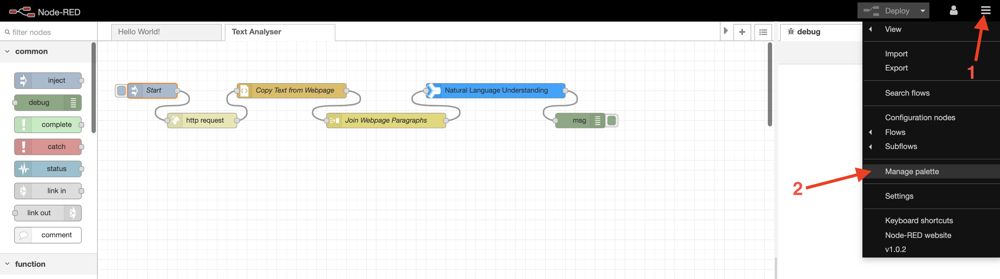

Click the `Install` tab, type in `node-red-dashboard`, then `Install` next to the `node-red-dashboard` option.

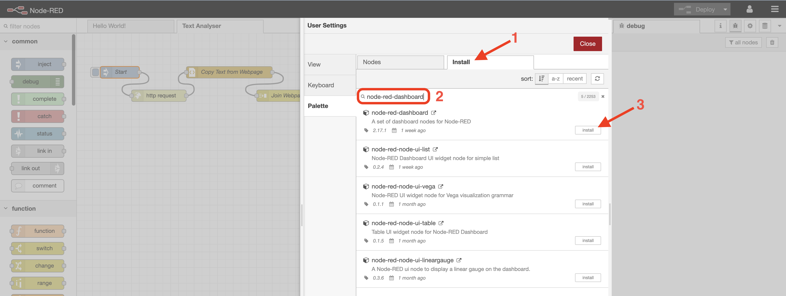

Select `Install` on the popup window that appears next, and then after a few seconds you will see another popup message informing you that the new nodes that have been added.

**(2)** Repeat this process to add the `node-red-node-base64` node. We don't need it for this particular lab, but we will need it later when we want to display images on a dashboard.

**(3)** Now onto creating our dashboard. It would take a while to build the dashboard components from scratch, so we've created them already for you to copy in to your existing flow.

Copy the contents of [this file](./code/nlu-dashboard.json), then go to yout Node-RED editor. Select the `burger icon` again, select `Import`, and then paste the code into the input box, and select `Import`.

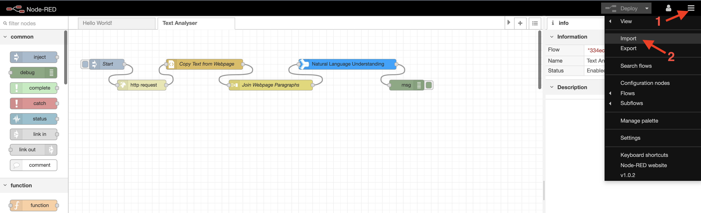

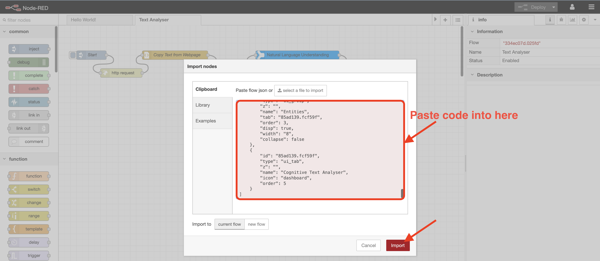

**(4)** Five new nodes will then appear in the editor, which you can move around the workspace with your mouse. When you click the mouse button, they will be positioned in the editor like this:

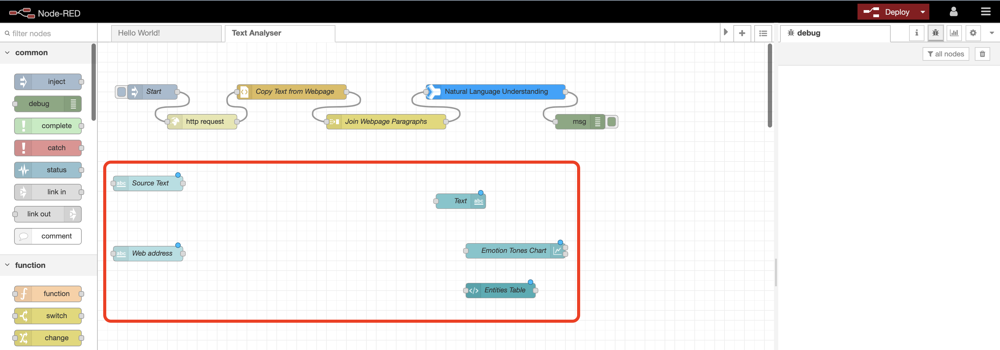

- The `Source Text` and `Web address` nodes are dashboard `text input` nodes that allows a user to enter either some raw text to be analysed by **Watson NLU**, or a web page to be processed then analysed as we saw in Lab 3.

- The `Text` node is a dashboard `text` widget that simply displays the first 500 characters of the text that is passed to it. If you double-click the node you'll see how this works - in the `Value format` field you can see:

  `{{msg.payload | limitTo: 500}}.....`

- This tells the node to output whatever is in `msg.payload`, limited to 500 characters, followed by an ellipsis that indicates the message has been truncated. This field can contain HTML and [Angular](https://scotch.io/tutorials/all-about-the-built-in-angularjs-filters) filters.

- The `Emotions Tone Chart` node is a Node-RED dashboard `chart` node that can use multiple input formats (using `msg.payload`, `msg.topic` and `msg.label`) to automatically produce a number of different charts. As with all Node-RED nodes, if you select it and go to the `Node information` tab you can see documentation on how to use the node.

  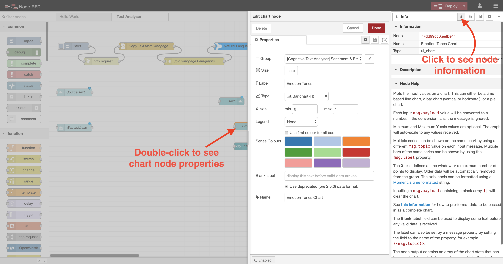

- Finally, the `Entities Table` node is a dashboard `template` node. `Template` nodes allow you to create custom widgets in Node-RED using HTML code - in this case we will be taking the results of the **Watson NLU** call as input and using a small amount of HTML to display it in tabular format. Double-click it if you want to take a look at the code.

**(5)** Delete the `Inject` node, drop in two `Function` nodes and a `Change` node, and position the nodes on the screen like so:

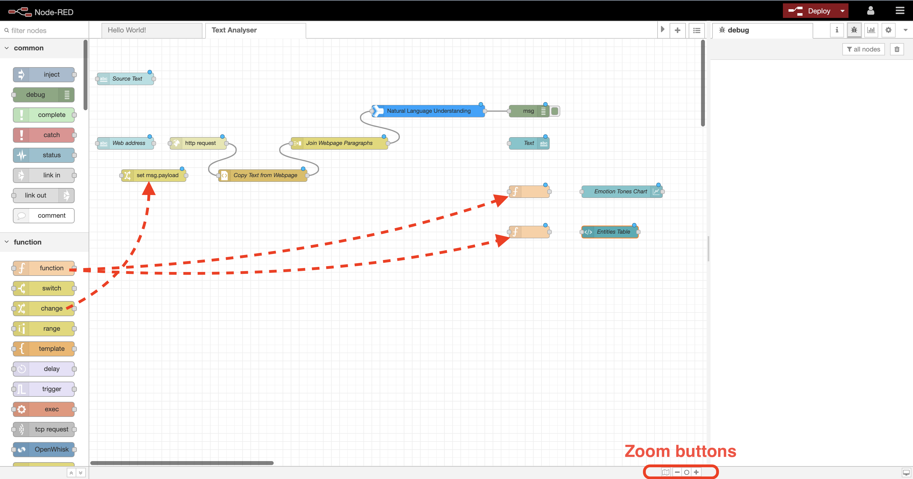

If you can't see all of your nodes on the screen at once, you can use the Node-RED editor zoom buttons.

**(6)** Edit the `Change` node to set `msg.url` to `msg.payload`. When the user enters a URL via the `Web address` node it will pass it on in `msg.payload`. The `http request` node is expecting the URL to be passed to it via `msg.url`, so the `Change` node does this simple transformation for us.

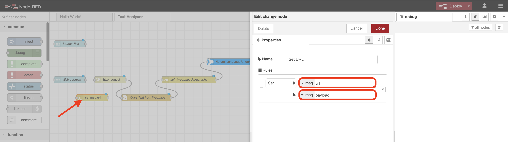

**(7)** Now go into the `http request` node and blank out the URL field, as we now want to pass the URL to analyse via the `Web address` field in the dashboard.

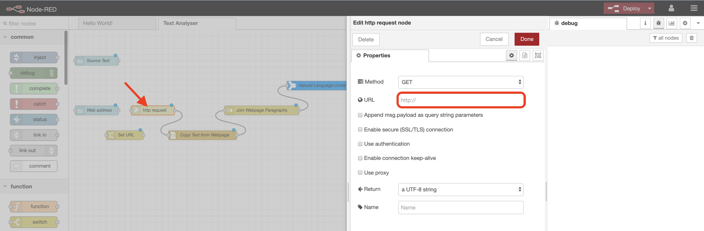

**(8)** Double-click the first `Function` node, call it `Convert for Chart`, copy in the code below, and change `Outputs` to **5**.

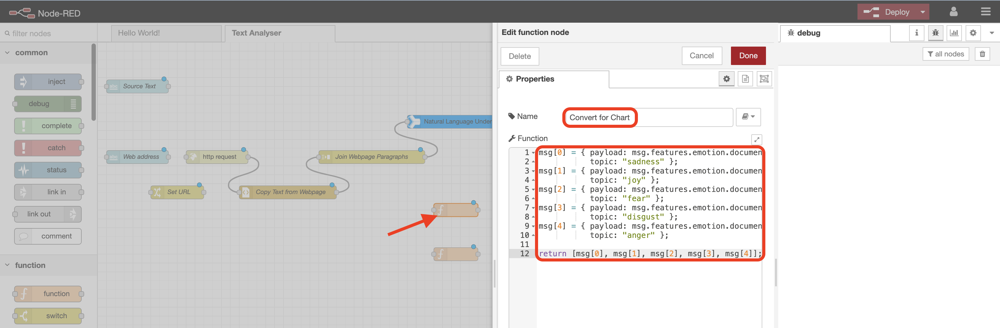

This short piece of code takes the _document emotion_ data passed from the **Watson NLU** analysis, and sends it to the `chart` node for display. We are sending five separate messages here representing the five emotions analysed by NLU - the `msg.payload` sent to the `chart` node is the value to display on the chart, whilst the `msg.topic` will be displayed as the chart label.

```javascript
msg[0] = { payload: msg.features.emotion.document.emotion.sadness,
           topic: "sadness" };
msg[1] = { payload: msg.features.emotion.document.emotion.joy,
           topic: "joy" };
msg[2] = { payload: msg.features.emotion.document.emotion.fear,
           topic: "fear" };  
msg[3] = { payload: msg.features.emotion.document.emotion.disgust,
           topic: "disgust" };
msg[4] = { payload: msg.features.emotion.document.emotion.anger,
           topic: "anger" };           

return [msg[0], msg[1], msg[2], msg[3], msg[4]];
```

**(9)** Modify the second `Function` node. Name it `Convert for Table` and use the code below.

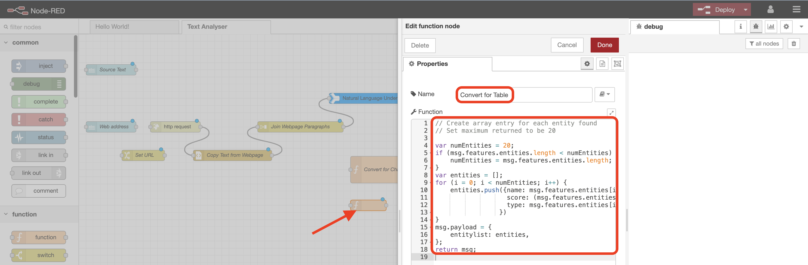

This code takes the top twenty `entities` recognised in the text by **Watson NLU**, builds a data structure containing the relevant results for each entity, and passes it to the `template` node for display in table format.

_Don't worry about the code! You can come back to it another time if you want to explore how Javascript programming works._

```javascript
// Create array entry for each entity found
// Set maximum returned to be 20

var numEntities = 20;
if (msg.features.entities.length < numEntities) {
    numEntities = msg.features.entities.length;
}
var entities = [];
for (i = 0; i < numEntities; i++) {
    entities.push({name: msg.features.entities[i].text,
                   score: (msg.features.entities[i].relevance * 100).toFixed(0) + " (" + (msg.features.entities[i].sentiment.score * 100).toFixed(0) + ")",
                   type: msg.features.entities[i].type.substring(0,10)
                 })
}
msg.payload = {
    entitylist: entities,
};
return msg;
```

**(10)** Connect the nodes up as shown here:

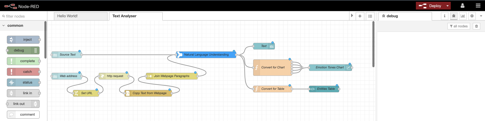

**(11)** Finally, go to the Node-RED `dashboard` tab and the `Site` sub-tab. Change the `1x1 Widget Size` values to `50`, and the `Widget Spacing` values to `15`. These modify the default dashboard sizes/spacings to make sure we can squeeze the full results table into a single widget.

You can also modify the look and feel of your dashboard via the `Theme` sub-tab. I recommend a `Style` of `Dark`, but feel free to customise to your own taste.

Now `Deploy`!

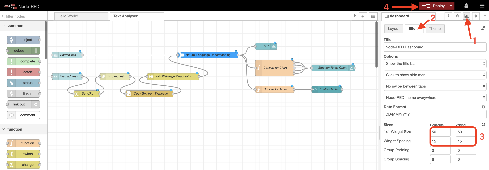

**(12)** Your AI Text Analyser application is now built and available via a publicly available webpage! To access it click the `link` icon on the `Dashboard` tab.

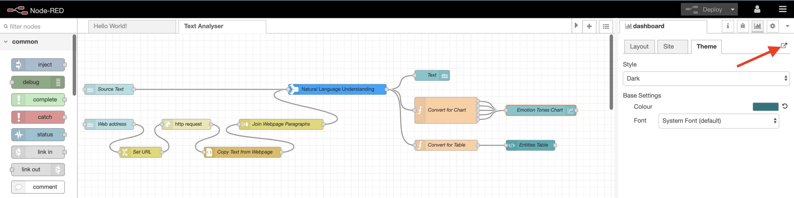

**(13)** Test your new application by entering some text or a web URL. The analysis will take a few seconds, and you'll then see output that looks something like this:

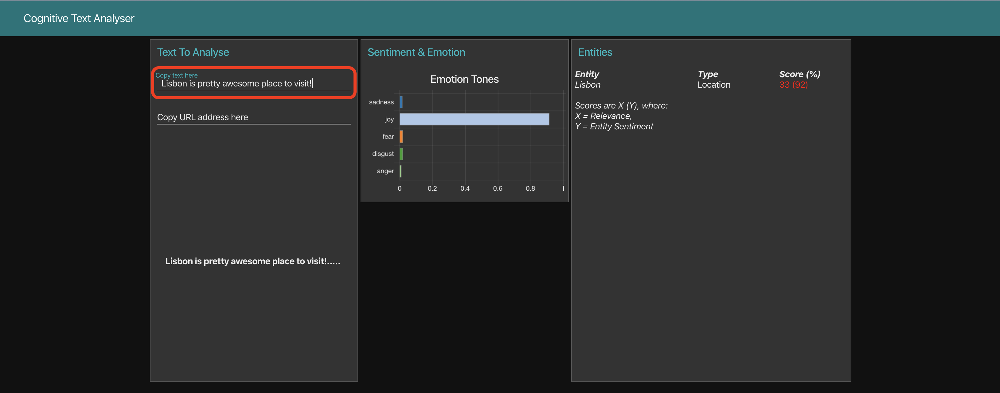

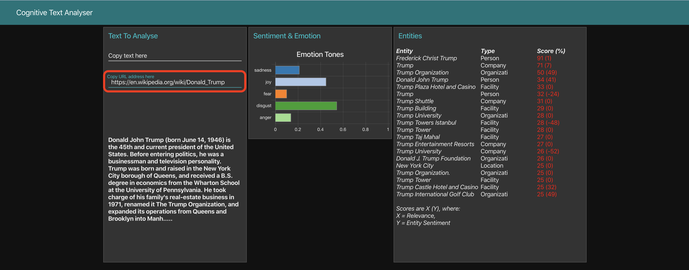

The NLU **emotion** feature detects anger, disgust, fear, joy, and sadness implied in text. A score of 0 means the text does not convey the emotion; 1 means the text definitely carries the emotion.

The **entities** feature helps you identify people, cities, organisations, and many other types of entities in your text. It returns items such as persons, places, and organisations that
are present in the input text. The **sentiment** feature identifies attitude, opinions, or feelings in the content that is being analysed. Here we are analysing the sentiment _around_ our extracted entities.

**Pretty cool, huh? Now you've built a live application that uses IBM Watson to analyse and classify text from user input or a webpage. Next, we'll use the same dashboarding techniques, but this time we'll apply them to a different AI use case - visual recognition. Click [here](../5-Visual) to go to Lab 5.**
