# **Lab 5:** _Creating a Visual Recognition Application_
So now we can build AI applications using IBM Watson and Node-RED dashboarding, let's apply this to another AI use case - visual recognition.

The **Watson Visual Recognition** service uses deep learning algorithms to analyse images for scenes, objects, food and other content. A set of built-in classes provides highly accurate results without training, and you can also train custom classifiers and collections using your own images.

In this lab are going to build an app that will use the default **Watson Visual Recognition** classifier and the Node-RED visual programming environment to classify any image you select from the internet (identified by its URL), and present the analysis using a dashboard.

This default classifier analyses images and provides a response that includes keywords (classes) that provide information about the image content, as well as confidence levels for each keyword. Our app will allow the user to enter a URL for an image, and pass the image to Watson which will return any classes found, the confidence level, and if it can find one, a class type (or hierarchy). For example, Watson would return a class type of `/fruit/pome/apple/eating apple/Granny Smith` if it sees a Granny Smith apple.

**(1)** Go to your Node-RED editor once more, and use `Add Flow` to add a new tab and get a blank workspace. Call it something like `Visual Recognition`.

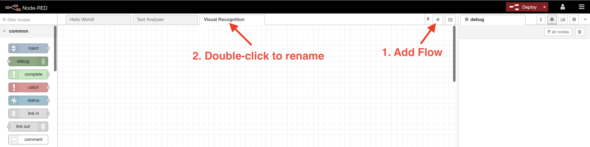

**(2)** From the sidebar, drag and drop `Inject`, `Visual Recognition` and `Debug` nodes onto the editor.

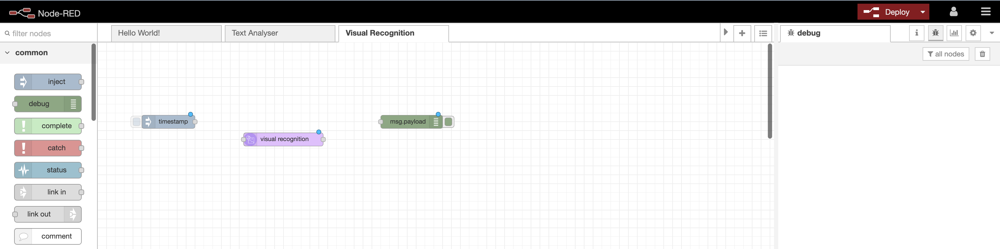

**(3)** In order to test the **Watson Visual Recognition** service, we'll use the `Inject` node to pass an image URL to it for processing (in the same way as we did in Lab 3 with the webpage URL), so we need to change the `Inject` node so that the payload is a string, and the text that is passed is the URL of an image from a web page.

Try a Google Images search to find an image. When you find a suitable one, right-click on it and select `Copy Image Address` to ensure your URL will reference the image itself rather than a whole webpage:


**(4)** Now double-click the `Inject` node, change the `Payload` to `string`, and paste in the URL you've just copied from Google Images.

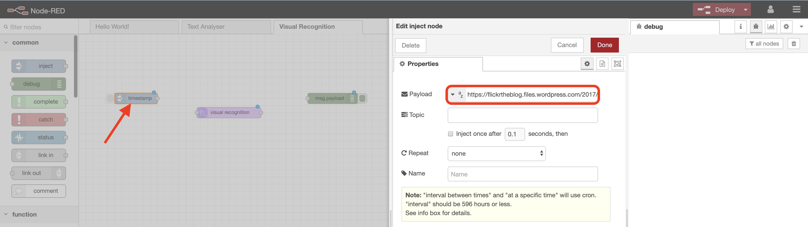

**(5)** You'll remember from previous labs that `Debug` nodes are used in Node-RED for testing and debugging purposes. In this flow we are going to pass the image URL to **Watson Visual Recognition**, which in turn will provide us with the results of its analysis via a message in JSON format. Connecting a `Debug` node here will allow us to read the message so we can ensure our programming flow is working correctly.

Double-click the `Debug` node and change the `Output` field so that it outputs the `complete message object` rather than just the default `msg.payload`. This is because we know that the **Watson Visual Recognition** analysis is returned in `msg.result`.

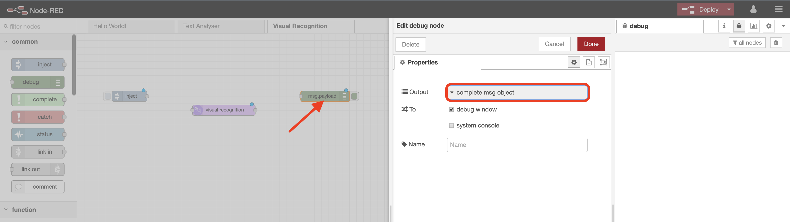

**(6)** _Note: whenever you select a node in the Node-RED editor and have the Information tab open, you will see documentation about the node - this will usually include expected inputs and and outputs._

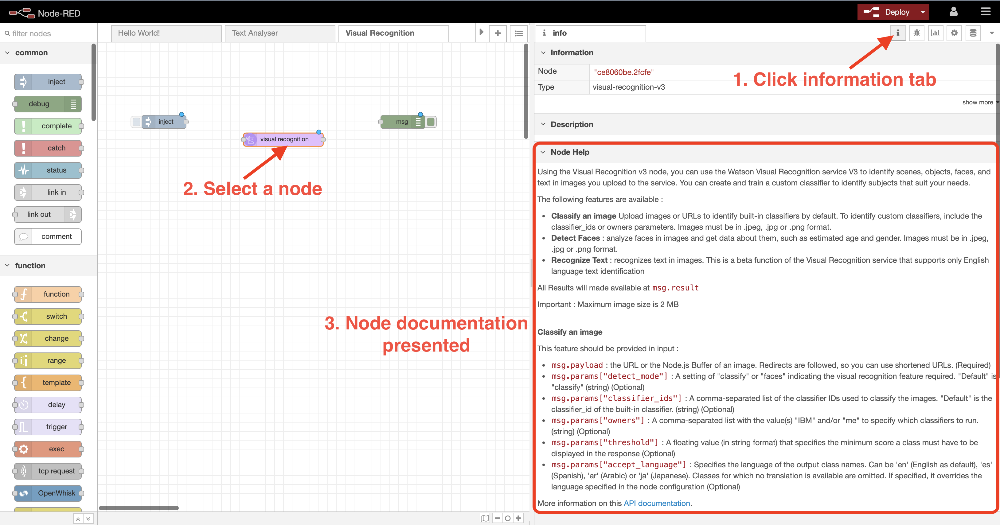

**(7)** Next, double-click the `Visual Recognition` node, then copy in the `API Key` from the security credentials for the **Watson Visual Recognition** service you saved earlier, and select the service endpoint highlighted below.

Hit `Done`, connect up your nodes, then `Deploy` your flow:

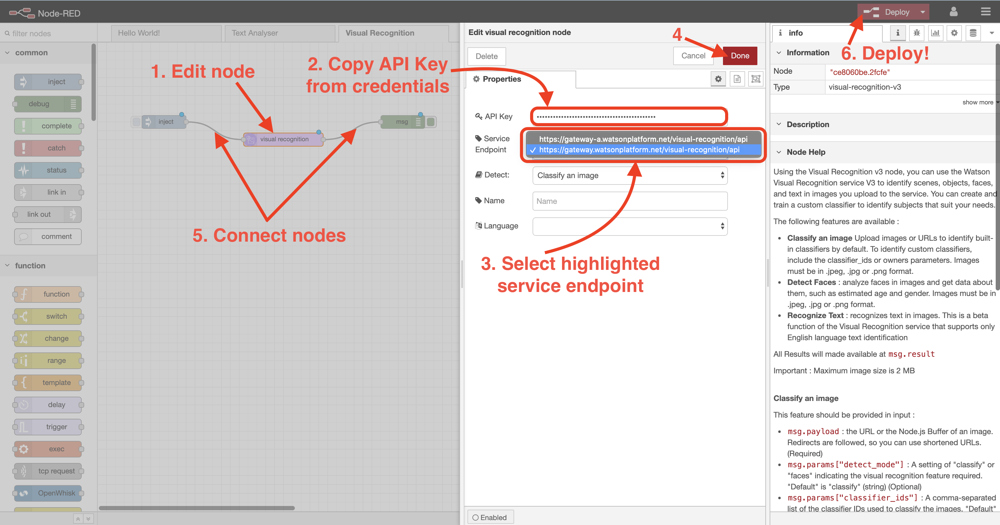

**(8)** Hit the button on the `Inject` node. If your image URL is valid, you should see something like this in the debug panel, where Watson has recognised object classes and hierarchies from the image.

You will need to expand the `result` object a number of times to get to the object classes. The scores here are _confidence levels_ - how confident Watson is that what is being reported is accurate.

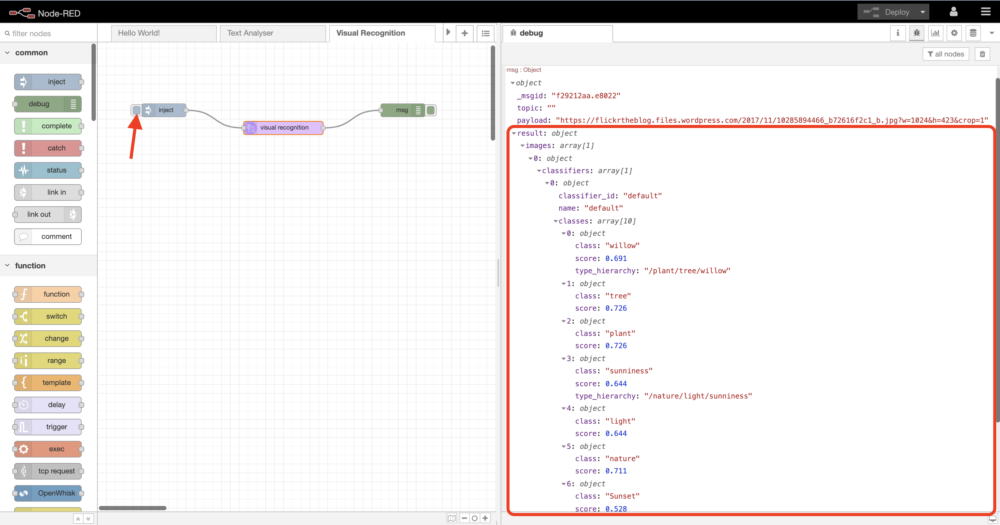

**(9)** Now let's take that output and create a web dashboard to display it in a more readable and accessible format. In order to save some time, we'll use some existing Node-RED code to create the dashboard.

Copy the code from [here](./code/visual-dashboard.json), and import it to Node-RED using the `burger` icon / `Import` / `Clipboard`, as you did in Lab 4.

On the **Import nodes** window, paste in the code and select `Import`. You should now have something like this:

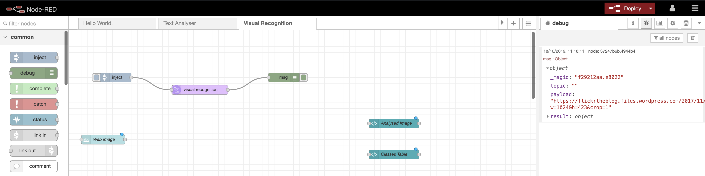

The `Web image` node creates a text input area on our dashboard which will allow us to directly enter an image URL address (rather than using the `Inject` node). The `Analysed image` and `Classes table` nodes are dashboard template nodes - the former simply displays the image we are asking Watson to analyse, and the latter creates a table from the results we receive from **Watson Visual Recognition** in `msg.result`.

**(10)** Next, drop in new `Change`, `HTTP Request`, `base64` and `Function` nodes,

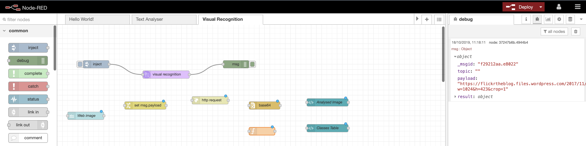

**(11)** Modify the `Change` node so it sets `msg.url` to `msg.payload`. This is what the HTTP request node is expecting as input.

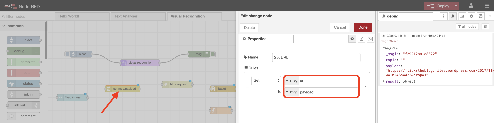

**(12)** Make sure the `HTTP Request` node has a method of `GET`, and that it returns `a binary buffer`. This is because we are getting an image from a webpage this time, rather than text.

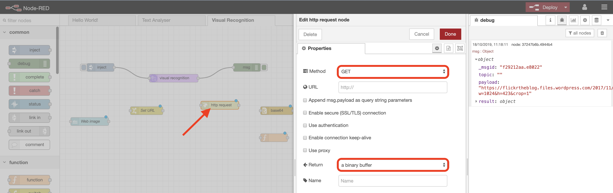

**(13)** Edit the `Function` node so it contains the code below. This will take the output from **Watson Visual Recognition** via `msg.result`, extracts the data we need, and formats it into a data structure that can be displayed on the dashboard:

```javascript
// Create array entry for each image class found by Watson Visual Recognition

var images = [];
for (i = 0; i < msg.result.images[0].classifiers[0].classes.length; i++) {
    images.push({class: msg.result.images[0].classifiers[0].classes[i].class,
                      score: (msg.result.images[0].classifiers[0].classes[i].score * 100).toFixed(0),
                      type: msg.result.images[0].classifiers[0].classes[i].type_hierarchy
                    })
}
msg.payload = {
    imagelist: images,
};
return msg;
```

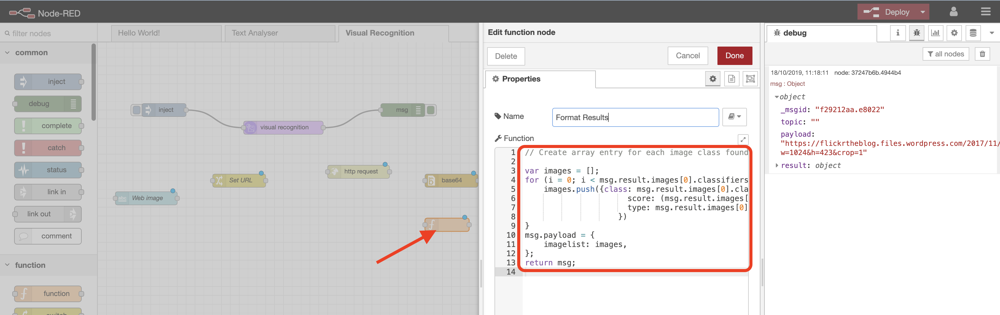

The `base64` node can be left to default - it's used to convert the image back to a displayable format on the dashboard.

**(14)** To complete the flow, delete the `Inject` and `Debug` nodes, connect the nodes up as shown below, and hit `Deploy`.

Once the flow is successfully deployed, go to your Node-RED dashboard via the `link icon`.

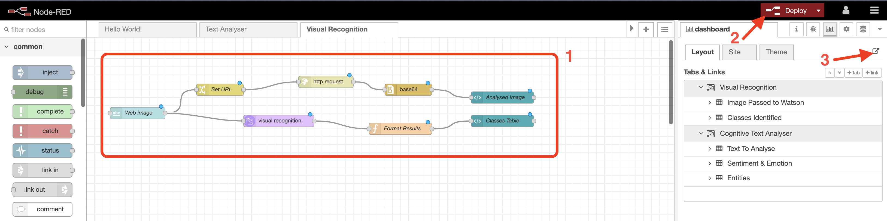

**(15)** The dashboard will look pretty blank at first, but if you enter an image URL in the text input field, your Node-RED flow will retrieve and display the image, pass it through **Watson Visual Recognition** for processing, and display the results!

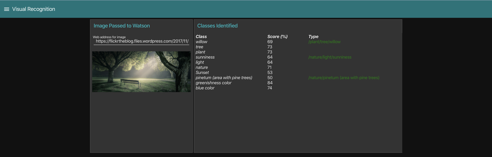

_Note that now you have created a second dashboard app, you have a burger icon (top left) - if you select this you can swap between your apps._

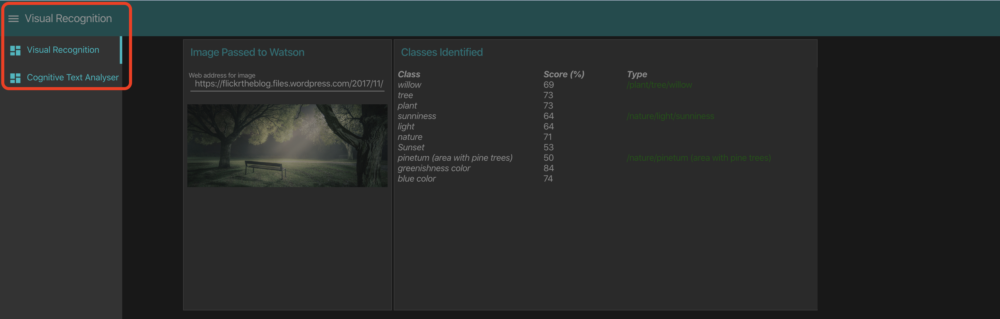

The **Watson Visual Recognition** service can be used for diverse applications and industries, such as:

Use Case  |  Example(s)
--|--
Manufacturing  |  Use images from a manufacturing setting to make sure that products are positioned correctly on an assembly line
Visual auditing  |  Look for visual compliance or deterioration in a fleet of trucks, planes, or windmills out in the field, train custom models to understand what defects look like
Insurance  |  Rapidly process claims by using images to classify claims into different categories
Social listening  |  Use images from your product line or your logo to track buzz about your company on social media
Social commerce  |  Use an image of a plated dish to find out which restaurant serves it and find reviews, use a travel photo to find vacation suggestions based on similar experiences
Retail  |  Take a photo of a favorite outfit to find stores with those clothes in stock or on sale, use a travel image to find retail suggestions in that area
Education  |  Create image-based applications to educate about taxonomies

**Well done! You've built another AI app that this time uses visual recognition. Now go ahead and try [Lab 6](../6-Earthquake), where you'll see how to interface with third party data sources and use Node-RED to create an interactive earthquake mapping application.**
