# **Lab 6:** _Building an Earthquake Mapping Application_
As we've seen, Node-RED has a great community base, so if you want to use Node-RED to interact with your [Amazon Echo](https://flows.nodered.org/node/node-red-contrib-amazon-echo), [access Google services](https://flows.nodered.org/node/node-red-node-google), [send SMS messages](https://flows.nodered.org/node/node-red-contrib-sms-twilio), [interact with Reddit](https://flows.nodered.org/node/node-red-contrib-node-reddit), or [get photos from Instagram](https://flows.nodered.org/node/node-red-node-instagram), somebody out there has already written Node-RED nodes that you can download and use.

Here, we're going to build an app that takes recent earthquake data from the United States Geological Survey (USGS) website, and highlights recent significant seismic activity on a map.

Fortunately, the nodes to produce interactive maps from sets of co-ordinates have already been created - for the details on Node-RED **Worldmap** nodes, click [here](https://flows.nodered.org/node/node-red-contrib-web-worldmap).

**(1)** As the **Worldmap** nodes are not present by default in Node-RED, we need to import them.  Add a new tab to your editor and call it `Earthquake`, then use the `burger icon` and select `Manage Palette`.

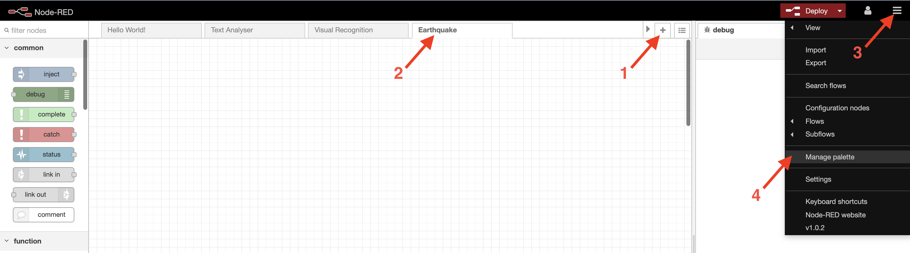

**(2)** Select the `Install` tab on the window that appears, then type in `worldmap`, then `Install` on the `node-red-contrib-web-worldmap` item.

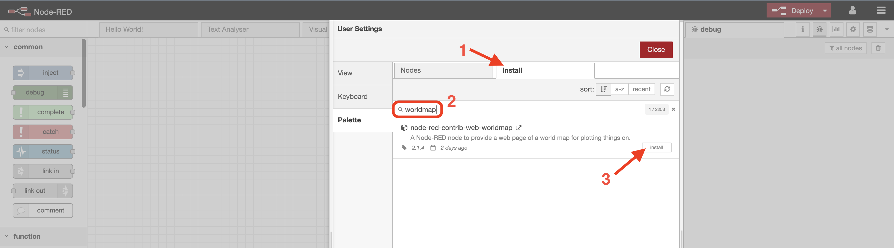

The nodes will install into your Node-RED environment, and you'll get a confirmatory message.

**(3)** To start with we'll prove that we can access the data we need. Add `Inject`, `HTTP Request` and `Debug` nodes.

Modify the Inject node, by renaming it to `Quakes!` Note here that you can also use `Inject` nodes to schedule actions via the `Repeat` field. So, for example, if you wanted to automatically retrieve updated data on an hourly or daily basis, you could do that via this field.

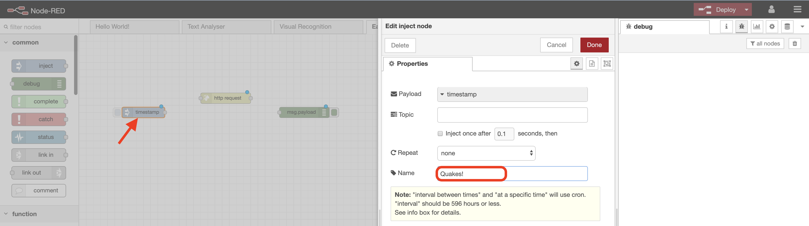

**(4)** The data we want to retrieve is held at the [USGS website](https://earthquake.usgs.gov). If you look for earthquake data on here, they helpfully provide it in multiple formats. We'll use a real-time feed of every earthquake over the last 24 hours with a strength of over 2.5.

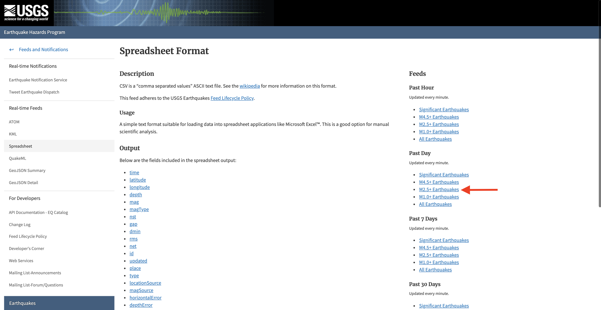

If you click this link it will download the latest earthquake data in spreadsheet format. It looks something like this:

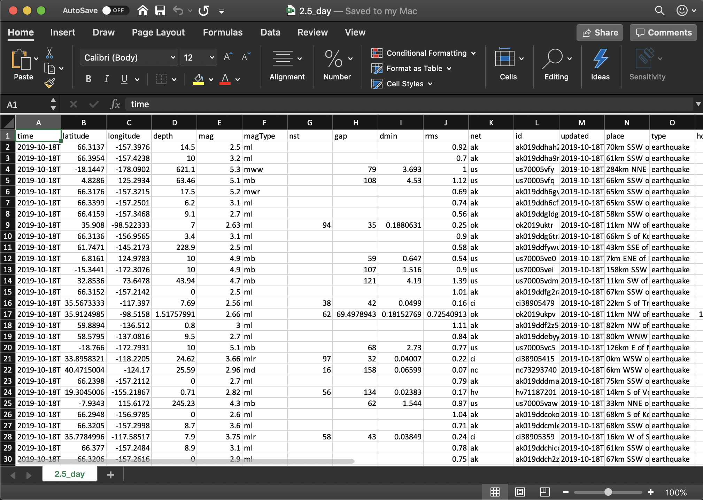

**(5)** We're going to use Node-RED to interact with and extract the data fields that we require from this spreadsheet, and plot this real-time seismic activity on a map.

The full URL for the spreadsheet is https://earthquake.usgs.gov/earthquakes/feed/v1.0/summary/2.5_day.csv, so let's plug that into our `HTTP Request` node.

_Important: make sure you also **untick** the `Append msg.payload as query string parameters` box._  

Everything else can be left to default.

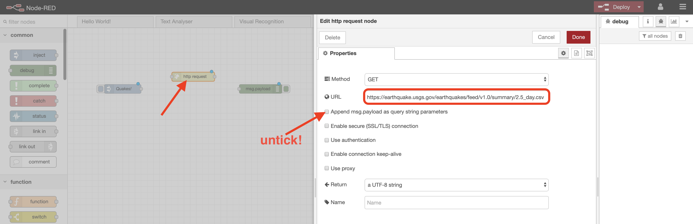

**(6)** Connect up these nodes, hit `Deploy`, then hit the `Inject` button. Your flow will then retrieve the data from the spreadsheet on the USGS website, and output it as a message in the debug window.

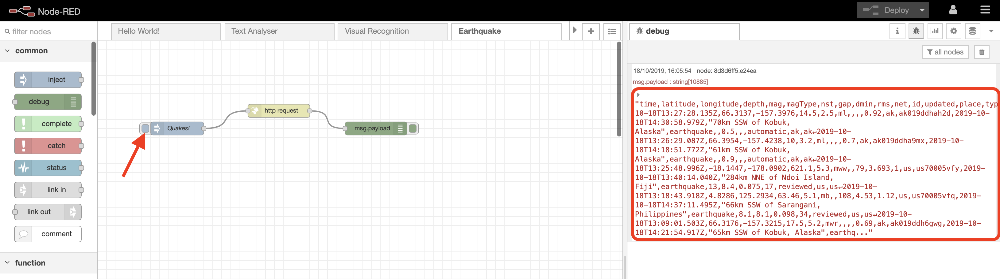

You can see here that this is just a text dump of the data from the spreadsheet, so we're going to have to find a way of extracting the information that we need.

**(7)** Drop a `CSV` node into your flow between the `HTTP Request` and the `Debug` nodes, and edit its properties.

This rather useful node can take a spreadsheet file in CSV format as input, and convert it to a data structure that can then be manipulated by other Node-RED nodes or programming languages such as Javascript. _It also works the other way, if you want to convert data to CSV format._

The only change you need to make in the node properties, is to ensure the `first row contains column names` field is **ticked**. If you look back at how the spreadsheet looks (step 5), you'll see that it has column names in the first row, so this option inform the node of this.

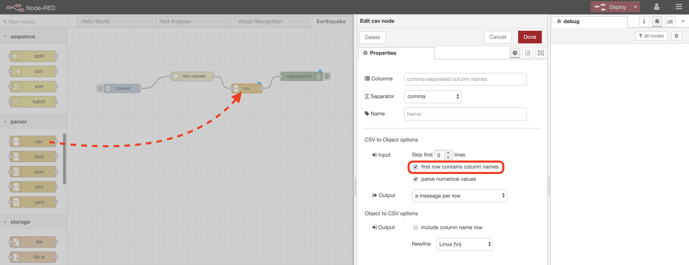

**(8)** Once again, ensure the nodes are connected up, hit `Deploy`, then hit the `Inject` button. This time you should see an individual message outputted for **each** row of the spreadsheet, in the debug window.

If you click on one of the messages you can expand it to see the data associated with each row, including _time, latitude, longitude, magnitude (mag), place,_ etc.

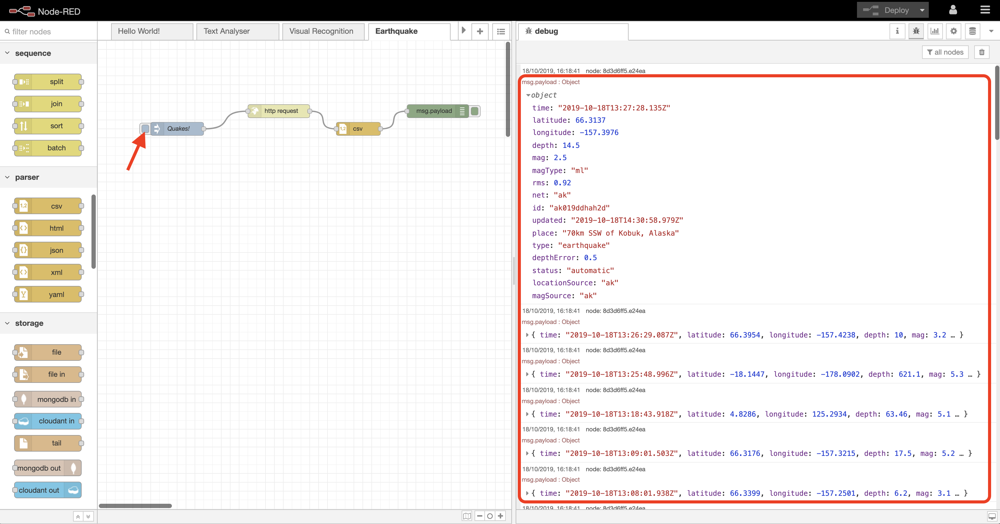

**(9)** Now we know we're getting the data correctly, we can now filter what we need, and send it to our `worldmap` node for display.

Delete the `Debug` node, as we no longer need it, then drop in a `Function` and a `Worldmap` node.

Edit the `Function` node. Call it `extract data for map` and copy in this code:

```javascript
msg.payload.lat = msg.payload.latitude;
msg.payload.lon = msg.payload.longitude;
msg.payload.layer = "earthquake";
msg.payload.name = msg.payload.place;
msg.payload.icon = "globe";
msg.payload.iconColor = "orange";

delete msg.payload.latitude;
delete msg.payload.longitude;
return msg;
```
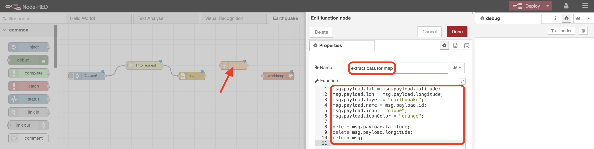

This node takes each individual message passed from the `CSV` node, and reformats the data in the way that the `Worldmap` node is expecting it.

For example, the `CSV` node passes the _longitude_ of the earthquake on as `msg.payload.longitude` (_longitude_ being the header extracted from the USGS spreadsheet), and if you look at the [Worldmap documentation](https://flows.nodered.org/node/node-red-contrib-web-worldmap), you'll see that a `Worldmap` node expects to receive a _longitude_ in `msg.payload.lat`.

There are a few other variables set here, some of which are involved with formatting of the map itself. Go to the [Worldmap documentation](https://flows.nodered.org/node/node-red-contrib-web-worldmap) to see how you can further customise maps, icons, colours, etc.

**(10)** The `Worldmap` node itself doesn't need any customisation here, so go ahead and wire the nodes up, hit `Deploy`, then the `Inject` button.

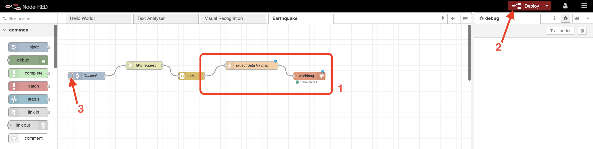

**(11)** The `Worldmap` interface is accessed via a URL that is constructed from your Node-RED application name, plus `/worldmap`.

Copy the URL from your Node-RED application up to and including `mybluemix.net/` and then append `/worldmap` to get your `Worldmap` URL.

So for example, if your Node-RED application URL was:

https://node-red-garywilson.eu-gb.mybluemix.net/

your Worldmap URL would be

https://node-red-garywilson.eu-gb.mybluemix.net/worldmap/

Copy this Worldmap URL into your browser, and you should see something like this:

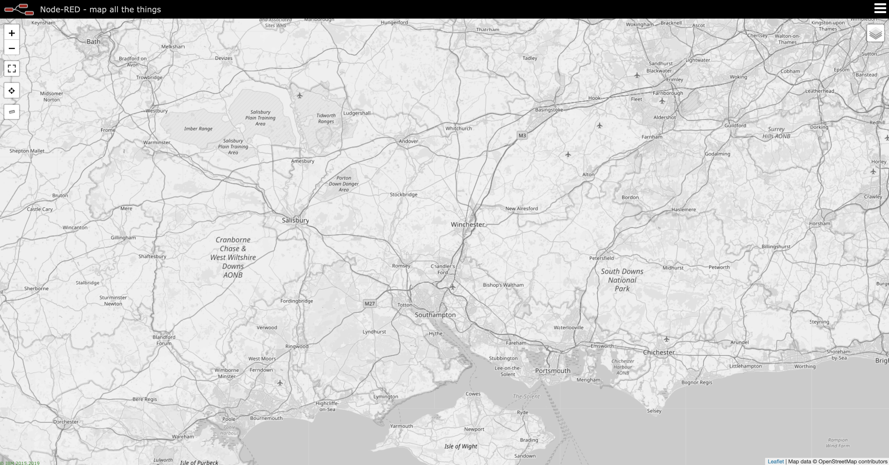

**(12)** OK, so we have a map, but it doesn't look very exciting, and we certainly can't see any seismic activity yet. But, if you `zoom out` several times until you get a whole world map view, you should see something like this:

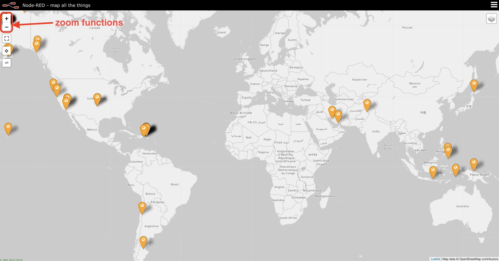

These are the positions of all of the earthquakes of 2.5+ magnitude that have occurred in the past 24 hours. Cool, eh?

And if you select any of them, you get all of the associated data about the quake:

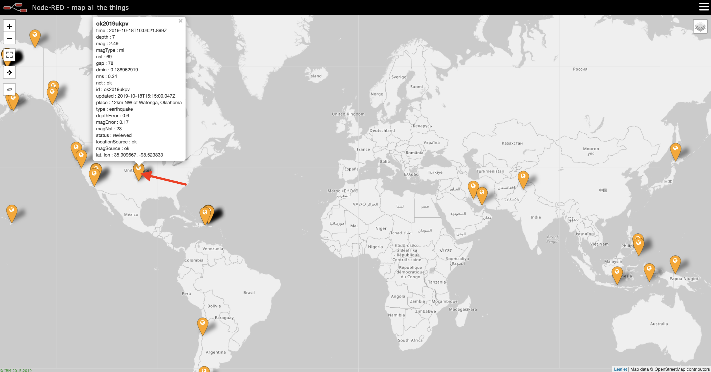

There are some other `Worldmap` nodes that allow you to preset different map types, zoom levels, etc. Again, first place to go for this is the [Worldmap documentation](https://flows.nodered.org/node/node-red-contrib-web-worldmap).

**Another one done! This lab demonstrates how you can interface with third party data using Node-RED, and also how you can use mapping capabilities when your data includes co-ordinate information. Next on our list is [Lab 7](../7-Translation) where you'll see how to build a cool translation app.**
