# **Lab 7:** _Constructing a Language Translation App_

This lab steps you through building a simple translation application, using the language identification and translation capabilities of **IBM Watson Language Translator**.

Whether you’re a business traveler or a billion-dollar airline, the ability to communicate with people from other countries and cultures can be critical. As an example, **IBM Watson Language Translator** has been a key component in the development of Lingmo’s Translate One2One earpiece, which can translate between nine different languages (English, Mandarin Chinese, Japanese, Arabic, Spanish, Italian, Portuguese, German and French). Content is translated and fed into the user’s ear in near-real time, delivering results within five seconds on average — and unlike most apps and other translation services, the earpiece does not rely on the user’s mobile phone to provide connectivity. Click [here](https://www.ibm.com/case-studies/lingmo-international1) for more information on how this great piece of innovation works!

Our prototype app will be a little more simplistic, but it will use a Node-RED dashboard to allow a user to enter some text and select a target language to translate the text to (from a pull-down list), recognise the language of the source input, translate the text into the target language, and display it on the dashboard. These are the same capabilities that Lingmo's device uses.

This time we will build the simple Node-RED dashboard components rather than importing them from existing code, so you can see how they are built from scratch.

**(1)** Go to your Node-RED application, open a new tab in Node-RED by clicking the `Add tab` icon, then rename the new tab to `Translator` by double-clicking it.

Using the `dashboard` area of the right sidebar, ensure you are using the `Layout` tab, then click `+ tab`, then `edit` the new dashboard tab you've created.

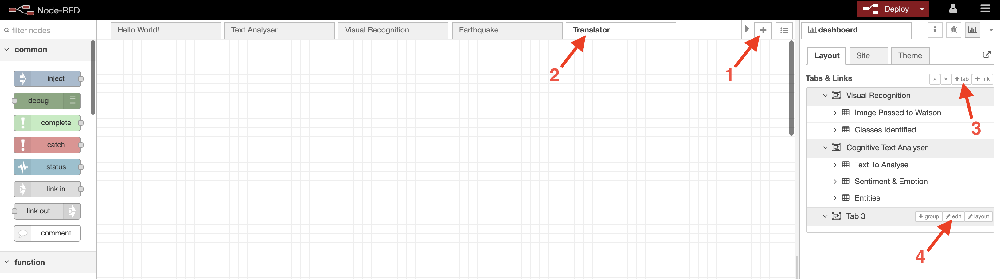

Rename the tab to `Translator`, and click `Update`.

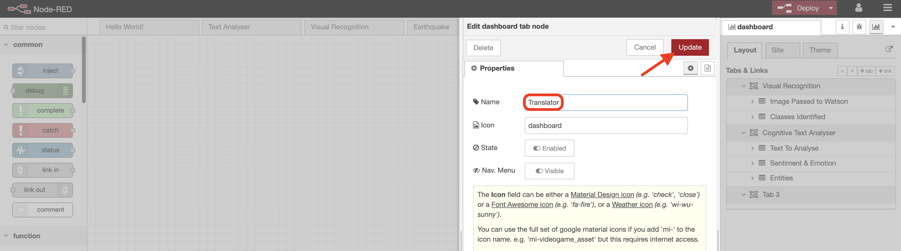

**(2)** We need two widgets on our new dashboard app - one for user inputs containing the source text and target language, and one for output of the translated message. We create these widgets using `groups` in Node-RED dashboards.

Add two groups to your new Translator tab like so:

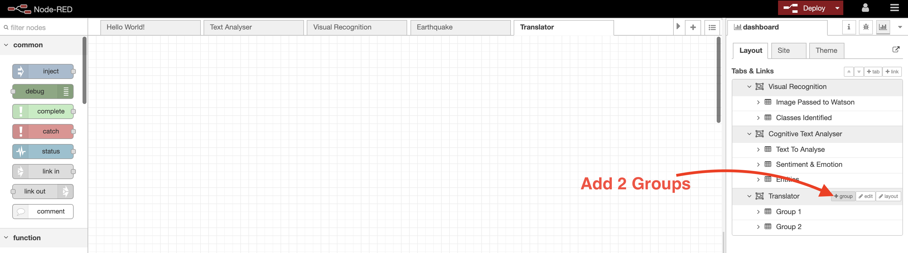

Change the default group names from:
- Group 1 --> `Source`
- Group 2 --> `Translated Text `

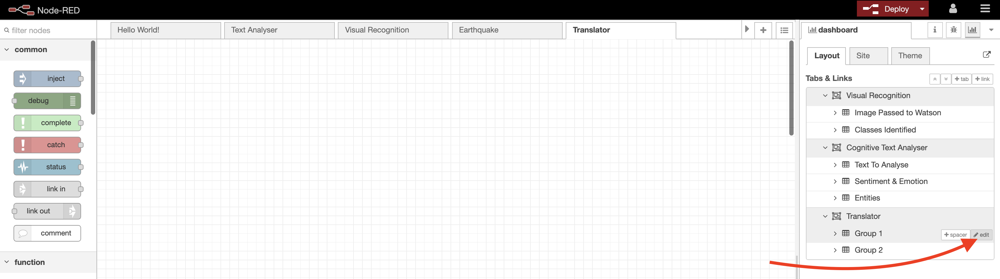

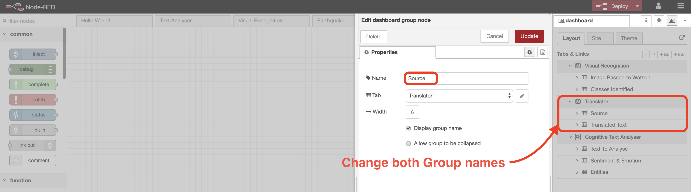

**(3)** Now let's add our user input fields.

Add a `text input` node to allow the user to enter some text to be translated. Double-click to edit the node, and change:
- Group --> `[Translator] Source`
- Size --> `6x2`
- Label --> `Enter text to translated`
- Delay (ms) --> `0`


This will give us an input field, as part of the `Source` widget in our `Translator` dashboard, which will send text on to our next node in the flow when enter is hit by the user.

**(4)** The other input field we need is one to specify a target language. We'll use a dropdown menu item here, to allow the user to select from a list of available languages.

Add a `dropdown` node to your flow. Change the `Group` to be `[Translator] Source` again, and the label to `Destination Language`.

Now we need to add the options we want to present to the user. **IBM Watson Language Translator** [supports over 30 languages](https://cloud.ibm.com/docs/services/language-translator?topic=language-translator-translation-models), in numerous combinations, but for this prototype we'll just add a selection.

In the `Options` field, type in `ar` in the first field, and `Arabic` in the second.

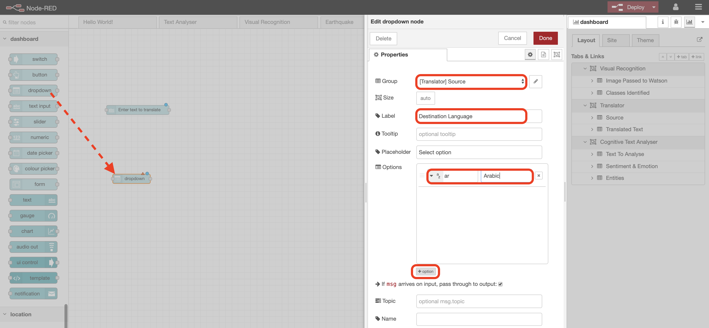

Now hit the `option` button, and repeat for each of the following pairs:
- `zh` `Chinese`
- `nl` `Dutch`
- `en` `English`
- `fr` `French`
- `de` `German`
- `it` `Italian`
- `ja` `Japanese`
- `pt` `Portuguese`
- `ru` `Russian`
- `es` `Spanish`
- `sv` `Swedish`

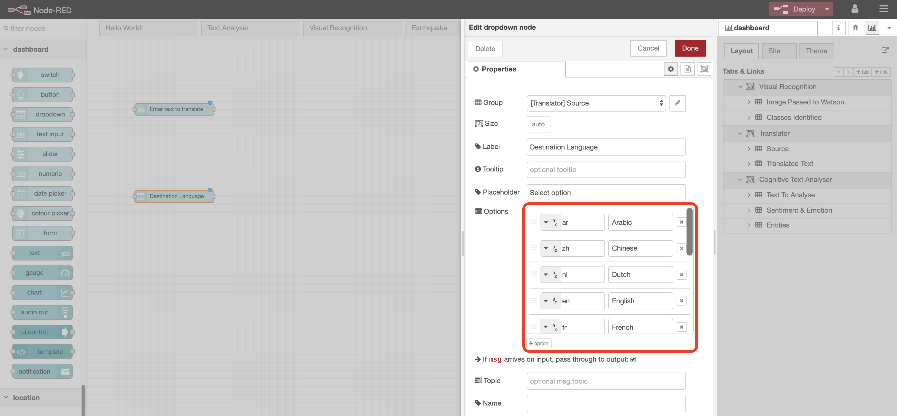

Watson uses standard IETF [two-character language codes](https://cloud.ibm.com/docs/services/language-translator?topic=language-translator-identifiable-languages). For each of the options you've added here, the `dropdown` node will display the second field in the dropdown menu item. When one of the items (languages) has been selected by the user in the dashboard, it passes the associated two character code (from the first field) to the the next node in the flow - the two-character IETF code is what Watson uses in order to perform the correct translation.

**(5)** Drop in a `change` node. Call it `Save Target Language` and make the rule `Set` `global.targetLanguage` to `msg.payload`.

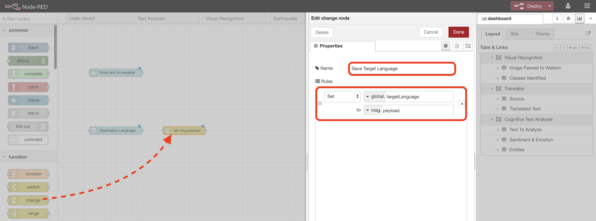

Node-RED provides a way of storing information that can be shared between different nodes without using the messages that pass directly through a flow. This is called [‘context’](https://nodered.org/docs/user-guide/context). What we are doing here is saving the target language in a Node-RED **context variable**, so we can use it elsewhere in our flow.

**(6)** Now add `language identity`, `language translator` and another `change` node.

The `language identity` node will take our source message, and call the **IBM Watson Language Translator** service to identify the source language. All you need to do with this node is fill in the _security credentials_ you saved during the initial setup. When it receives a message, it will identify the language of the message, and then pass the IETF code for the identified language to the next node in `msg.lang.language`.

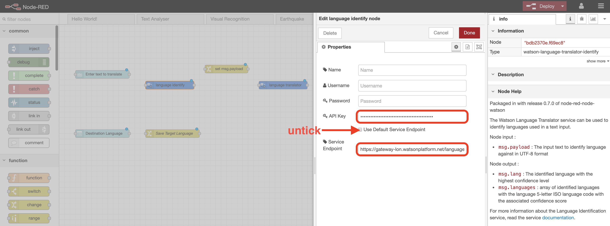

Do the same with the `language translator` node - just edit the `API Key` and `Service Endpoint` fields with your security credentials.

The `language translator` node is expecting the source language code in `msg.srclang`, and the target language in `msg.destlang`, so we'll use the `change` node to set this up:

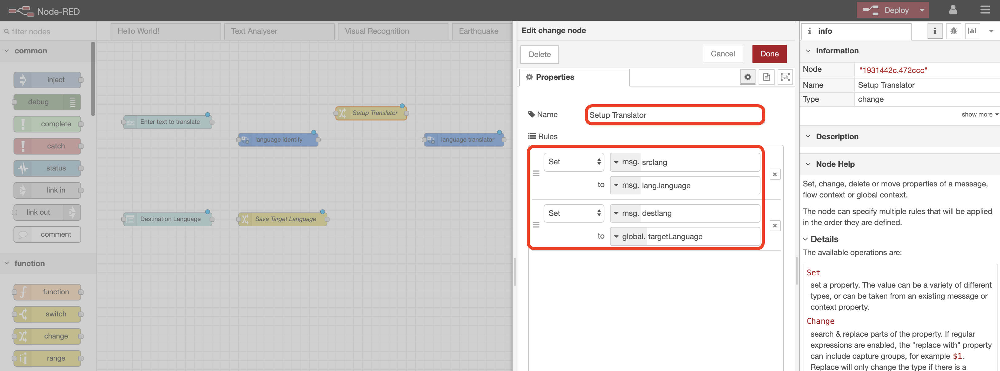

`msg.srclang` we are retrieving directly from the previous `language identity` node, and `msg.destlang` we will get from the _context variable_ we set via the `dropdown` node.

**(7)** Our flow to this point has constructed a translated message, so we now need to output it to the dashboard. However there is not a one-to-one translation model for every language combination, so we need to be able to output an error message if Watson is unable to perform the translation.

Drop in a `switch` node and a `function` node.

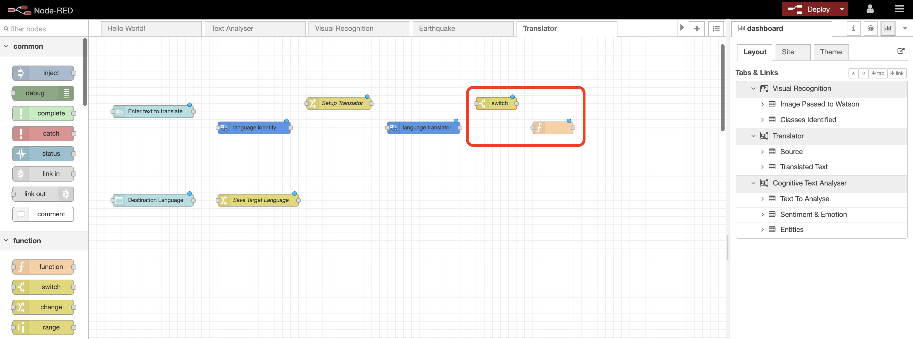

We'll use the `switch` node to change the output message if the `language translator` node throws an error (e.g. if the language model doesn't exist). If there is a problem, the `language translator` node sets the `msg.watsonerror` variable to something other than `null`. Edit the `switch` node so it looks like this:

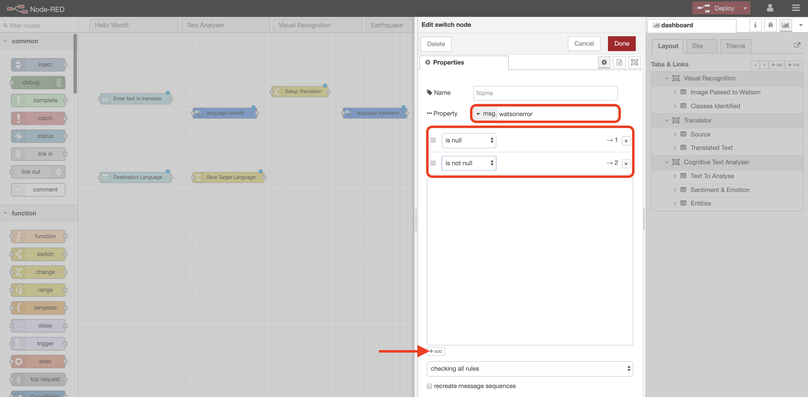

Add a path via the `+ add` button, and configure the node so it tests `msg.watsonerror`, going to output 1 if its `null`, and output 2 if its `not null`.

Edit the `function` node and copy in the following code:

```javascript
msg.payload = "Translation model <i>" + msg.srclang + "-" + msg.destlang + "</i> does not yet exist in Watson Language Translator.<br><br>" + "Go to https://cloud.ibm.com/docs/ to find a list of available translation models."
return msg;
```

This short piece of code just constructs the error message we'll output if there is no translation model available.

**(8)** Drop in our last node, which will be a dashboard `text` node we'll use to output the translated message.

Ensure:
- `Group` is set to `[Translator] Translated Text`
- `Size` is `6x6`
- `Label` is blanked out
- `Layout` is set to the top left option

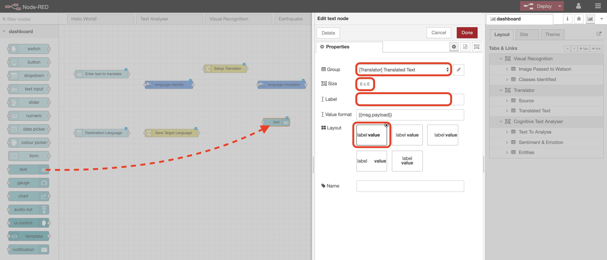

This node displays whatever is currently in `msg.payload` (by default), in a text field on the dashboard.

**(9)** Connect the nodes up as you see below, then `Deploy`.

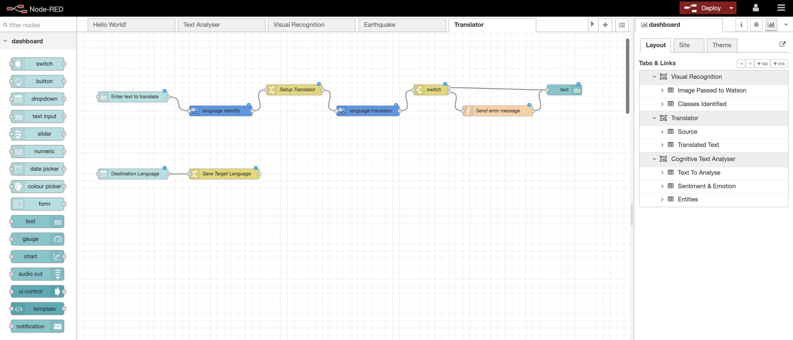

**(10)** Go to your Node-RED dashboard (if you don't have it open already, remember you can click on the icon in the dashboard side panel), and click the `burger` icon to find your new `Translator` page.

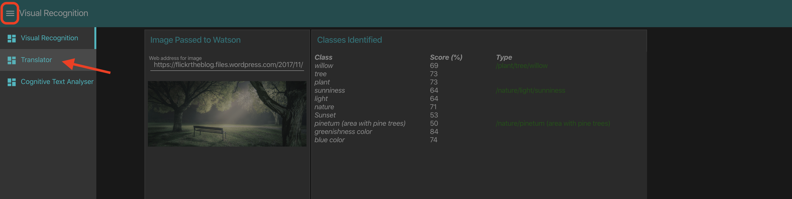

**(11)** Test your app! Use the dropdown menu to select a target language, and then enter some text to see the translation appear in the output field.

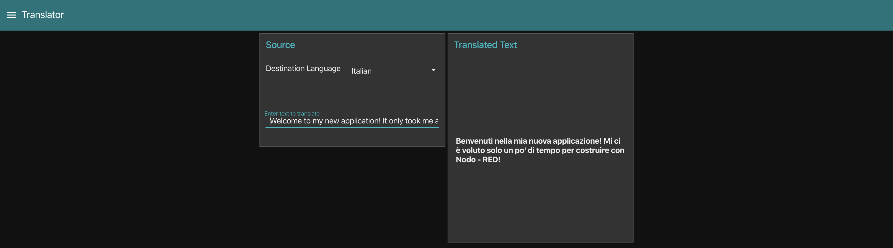
_English to Italian_

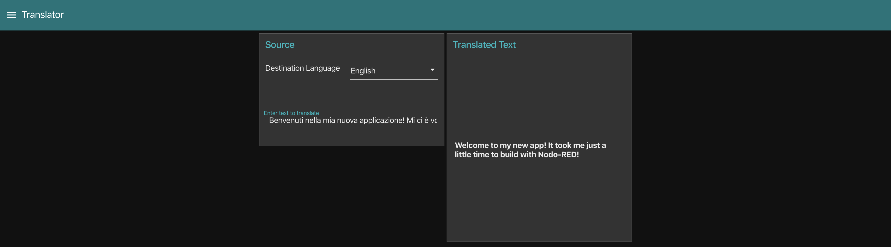
_Italian to English_

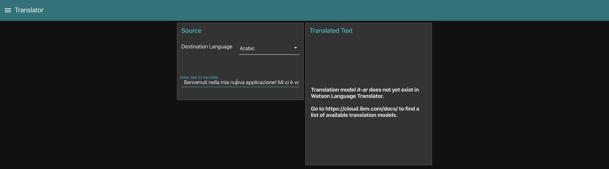
_Error as Italian to Arabic language model does not exist_


_English to Japanese_

**Well done! You've now built a simple Node-RED dashboard application from scratch, as well as using Watson's language translation capabilities. Click [here](../README.md) to go back to the lab homepage.**
